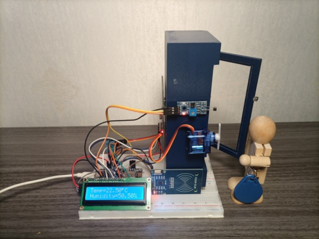
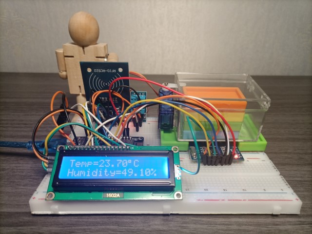

[English](README.md)|[中文](docs/zh/README.md)

# flower-esp8266
Use ESP8266 as IoT device to demo business concept.

### Preparations
**Hardwire:**

| Name | Pieces |
| :--- | ---: | 
| ESP8266 Development Board | 1 |
| DHT11 | 1 |
| LCD1602 | 1 |
| Breadboard | 1 |
| RFID-RC522 | 2 |
| SG90 (Micro Servo 9g) | 1 |
| RFID Card or Label (ISO-14443) | 1+ |
   
<br/>

You can find [Arduino RFID Starter Kit](https://www.aliexpress.com/wholesale?catId=0&initiative_id=SB_20200814105627&SearchText=arduino+rfid+starter+kit) and [ESP8266](https://www.aliexpress.com/w/wholesale-ESP8266.html) on AliExpress, the total cost should be less than 40USD.

<br/>

**Software**
* Download and install [Arduino IDE](https://www.arduino.cc/en/Main/Software)

* Optional: download and install [Fritzing](https://fritzing.org/download/)

<br/>

**Arduino Preference**

在Arduino中，选择菜单【文件】->【首选项】->【附加开发板管理器网址】中，输入：

```
http://arduino.esp8266.com/stable/package_esp8266com_index.json
```

搜索并安装ESP8266版本2.7.4。**注意：**目前的代码，无法在3.0以上版本运行。

<br/>

**Services**

* OneNET MQTT

<br/>

### Contents
* [ESP8266测量和显示温度/湿度](docs/zh/esp8266-dht11-lcd1602.md) 
* [ESP8266联WiFi上网](docs/zh/esp8266-wifi-http.md)
* [ESP8266访问Https网页](docs/zh/esp8266-wifi-ssl.md)
* [ESP8266使用证书库验证和访问Https网页](docs/zh/esp8266-bearssl-certstore.md)
* [ESP8266实现Base64编码/解码](docs/zh/esp8266-base64.md)
* [ESP8266 HMac-MD5](docs/zh/esp8266-hmac-md5.md)
* [ESP8266 Hmac-Sha1](docs/zh/esp8266-hmac-sha1.md)
* [ESP8266 Hmac-Sha256](docs/zh/esp8266-hmac-sha256.md)
* [ESP8266实现对Bytes进行Base64编码](docs/zh/esp8266-base64-from-bytes.md)
* [ESP8266实现OneNET URL编码](docs/zh/esp8266-onenet-urlencode.md)
* [注册OneNET MQTTS产品](docs/zh/register-onenet-mqtts.md)
* [ESP8266生成OneNET MQTTS密码(MD5)](docs/zh/esp8266-onenet-mqtts-password-md5.md)
* [ESP8266生成OneNET MQTTS密码(SHA1)](docs/zh/esp8266-onenet-mqtts-password-sha1.md)
* [ESP8266生成OneNET MQTTS密码(SHA256)](docs/zh/esp8266-onenet-mqtts-password-sha256.md)
* [ESP8266连接OneNET MQTTS](docs/zh/esp8266-onenet-mqtts-connect.md)
* [ESP8266发布/订阅OneNET MQTTS](docs/zh/esp8266-onenet-mqtts-pubsub.md)
* [ESP8266接受OneNET MQTTS命令](docs/zh/esp8266-onenet-mqtts-command.md)
* [ESP8266 RC522读卡](docs/zh/esp8266-rc522-onenet-mqtts.md)
* [ESP8266 两个RC522读卡](docs/zh/esp8266-2rc522-onenet-mqtts.md)

<br/>

## Scenarios
The following scenarios can be used for proof of concept or entry level training on 'Each object has its own unique identity'.

### Retail
* [RFID-Operated Vendering Marchines](docs/zh/retail/rovem/README.md)

  [](docs/zh/retail/rovem/README.md)

<br/>

* [RFID-Operated POS](docs/zh/retail/pos/README.md)

  [](docs/zh/retail/pos/README.md)

<br/>

### Home
* [RFID-Operated Wardrobe]()

<br/>
