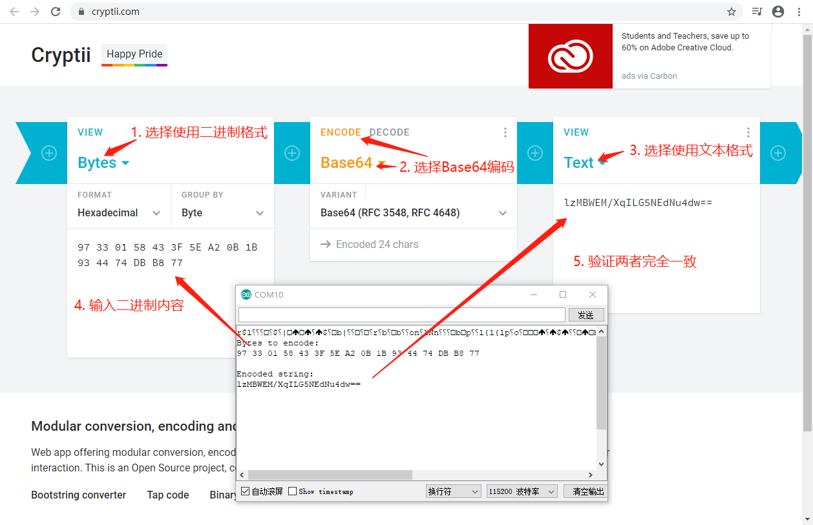

# ESP8266对bytes生成Base64编码

在计算OneNET密码时，需要使用从bytes得到Base64编码的chars。在网上搜索了下，没有找到现成的实现，于是参考[Cryptii从bytes得到Base64编码的Javascript实现](https://github.com/cryptii/cryptii/blob/master/src/ByteEncoder.js)，将其中的base64StringFromBytes改写为了c++实现：

<br/>

```c++
#include <sstream>

#define base64_alphabet "ABCDEFGHIJKLMNOPQRSTUVWXYZabcdefghijklmnopqrstuvwxyz0123456789+/"
#define base64_padding '='

byte bytes_to_encode[16] = {0x97, 0x33, 0x01, 0x58, 0x43,
                            0x3F, 0x5E, 0xA2, 0x0B, 0x1B,
                            0x93, 0x44, 0x74, 0xDB, 0xB8,
                            0x77};

void setup() {
  Serial.begin(115200);
  Serial.println();
  Serial.println();
  Serial.println("Bytes to encode:");
  for (int i = 0; i < 16; i++) {
    byte b = bytes_to_encode[i];
    if(b < 0x10) Serial.print('0');
    Serial.print(b, HEX);
    Serial.print(' ');
  }
  Serial.println();
  Serial.println();

  char* encoded_result = base64_string_from_bytes(bytes_to_encode, sizeof(bytes_to_encode));
  Serial.println("Encoded string: ");
  Serial.println(encoded_result);
  Serial.println();
}

void loop() {
  // put your main code here, to run repeatedly:

}

char* base64_string_from_bytes(byte bytes[], int bytes_size) {
  byte byte1, byte2, byte3;
  char octet1, octet2, octet3, octet4;
  std::stringstream ss;

  for (int i = 0; i < bytes_size; i += 3) {
    // Collect pair bytes
    byte1 = bytes[i];
    byte2 = i + 1 < bytes_size ? bytes[i + 1] : NULL;
    byte3 = i + 2 < bytes_size ? bytes[i + 2] : NULL;

    // Bits 1-6 from byte 1
    octet1 = byte1 >> 2;

    // Bits 7-8 from byte 1 joined by bits 1-4 from byte 2
    octet2 = ((byte1 & 3) << 4) | (byte2 >> 4);

    // Bits 4-8 from byte 2 joined by bits 1-2 from byte 3
    octet3 = ((byte2 & 15) << 2) | (byte3 >> 6);

    // Bits 3-8 from byte 3
    octet4 = byte3 & 63;

    // Map octets to characters
    ss << base64_alphabet[octet1] 
       << base64_alphabet[octet2]
       << (byte2 != NULL ? base64_alphabet[octet3] : base64_padding)
       << (byte3 != NULL ? base64_alphabet[octet4] : base64_padding);
  }

  return &*ss.str().begin();
}
```

<br/>

其中，第25行调用了函数base64_string_from_bytes；第36-67行是base64_string_from_bytes的详细实现。

执行上述代码，把串口监视器的输出结果，与cryptii.com的结果进行比较，Base64值一致，如下图所示：



<br/>

**结论：代码生成的结果与cryptii.com一致。**

<br/>

### 参考资料

1. Cryptii从bytes得到Base64编码的Javascript实现：https://github.com/cryptii/cryptii/blob/master/src/ByteEncoder.js