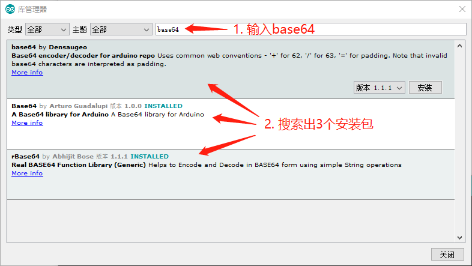
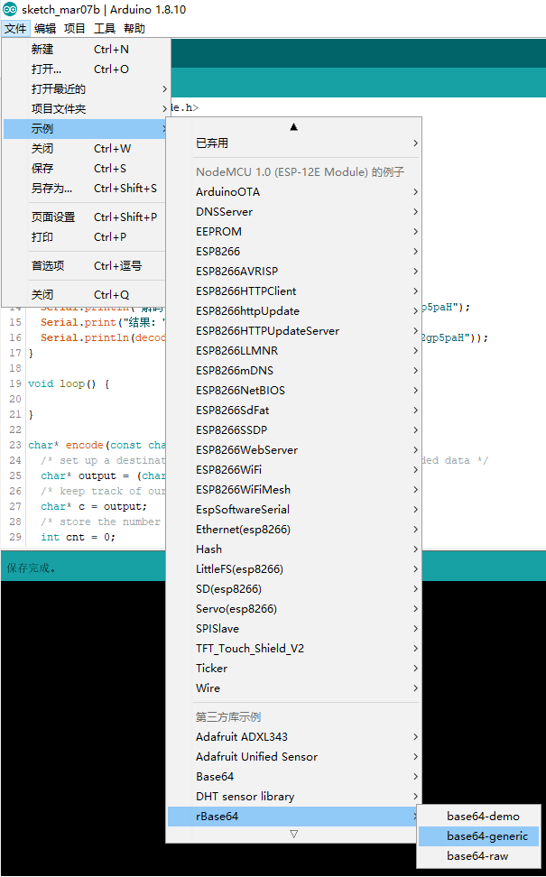
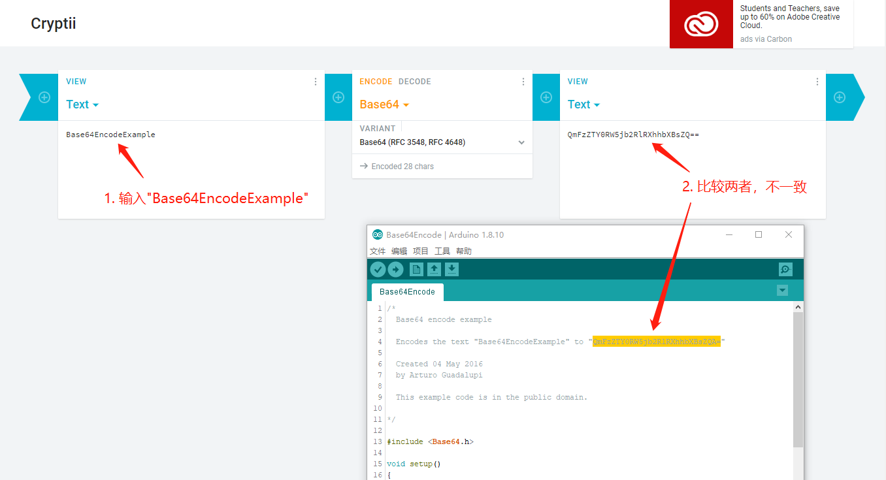
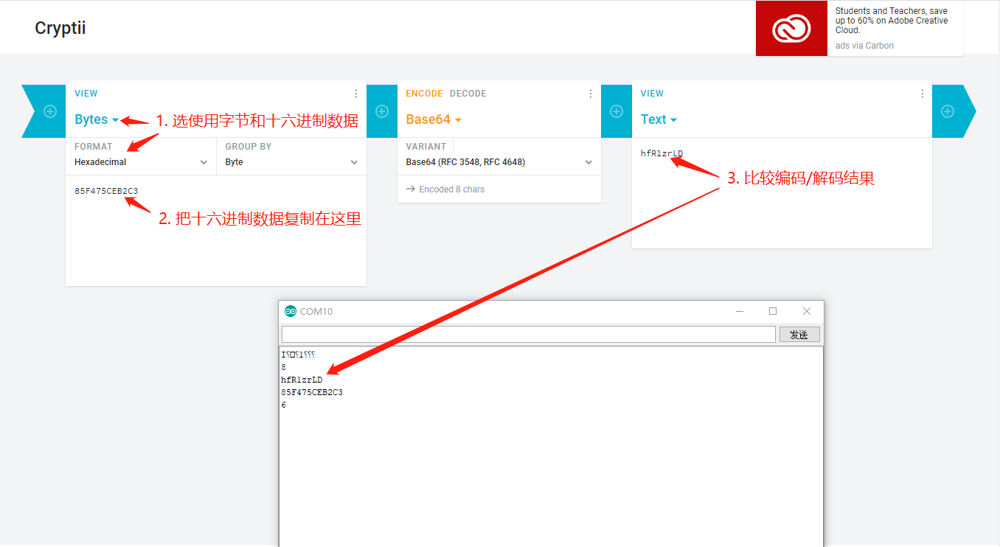

# Base64编码/解码

Arduino IDE的库管理器中，搜索base64，可以搜到3个base64实现。ESP8266支持WiFi加密连接，用的是ESP8266 ROM中的Base64编码/解码方法，具体实现是基于[Libb64](http://libb64.sourceforge.net/)。

本文对下列Base64编码/解码实现进行了验证：

* [基于Libb64的Base64实现](#基于Libb64的Base64实现) 
* [基于rBase64 by Abhijit Bose的实现](#基于rBase64byAbhijitBose的实现) 
* [基于Base64 by Arturo Guadalupi的实现](#基于Base64byArturoGuadalupi的实现) 
* [基于base64 by Densaugeo的实现](#基于base64byDensaugeo的实现) 

**结论**：推荐使用ESP8266 ROM的Libb64实现，来进行Base64编码/解码。

<br/>

### 基于Libb64的Base64实现

在ESP8266 Arduino代码库（https://github.com/esp8266/Arduino） 中搜索base64，会出现如下图所示的结果：


<br/>

参考Libb64 Base64样例：​https://sourceforge.net/p/libb64/git/ci/master/tree/examples/c-example1.c ，编写了如下的代码，使用ESP8266 ROM中的代码实现Base64编码/解码：

```c++
#include <libb64/cencode.h>
#include <libb64/cdecode.h>

/* arbitrary buffer size */
#define SIZE 100

void setup() {
  Serial.begin(9600);
  Serial.println();
  
  Serial.println("编码：温度=25.20℃, 湿度=44.00%；");
  Serial.print("结果：");
  Serial.println(encode("温度=25.20℃, 湿度=44.00%；"));
  Serial.println("解码：5rWL6K+V5LitKENoaW5lc2Up6IuxKEVuZ2xpc2gp5paH");
  Serial.print("结果：");
  Serial.println(decode("5rWL6K+V5LitKENoaW5lc2Up6IuxKEVuZ2xpc2gp5paH"));
}

void loop() {

}

char* encode(const char* input) {
  /* set up a destination buffer large enough to hold the encoded data */
  char* output = (char*)malloc(SIZE);
  /* keep track of our encoded position */
  char* c = output;
  /* store the number of bytes encoded by a single call */
  int cnt = 0;
  /* we need an encoder state */
  base64_encodestate s;
  
  /*---------- START ENCODING ----------*/
  /* initialise the encoder state */
  base64_init_encodestate(&s);
  /* gather data from the input and send it to the output */
  cnt = base64_encode_block(input, strlen(input), c, &s);
  c += cnt;
  /* since we have encoded the entire input string, we know that 
     there is no more input data; finalise the encoding */
  cnt = base64_encode_blockend(c, &s);
  c += cnt;
  /*---------- STOP ENCODING  ----------*/
  
  /* we want to print the encoded data, so null-terminate it: */
  *c = 0;
  
  return output;
}

char* decode(const char* input) {
  /* set up a destination buffer large enough to hold the encoded data */
  char* output = (char*)malloc(SIZE);
  /* keep track of our decoded position */
  char* c = output;
  /* store the number of bytes decoded by a single call */
  int cnt = 0;
  /* we need a decoder state */
  base64_decodestate s;
  
  /*---------- START DECODING ----------*/
  /* initialise the decoder state */
  base64_init_decodestate(&s);
  /* decode the input data */
  cnt = base64_decode_block(input, strlen(input), c, &s);
  c += cnt;
  /* note: there is no base64_decode_blockend! */
  /*---------- STOP DECODING  ----------*/
  
  /* we want to print the decoded data, so null-terminate it: */
  *c = 0;
  
  return output;
}
```

<br/>

这段代码在串口监视器中的输出如下：

```
编码：温度=25.20℃, 湿度=44.00%；
结果：5rip5bqmPTI1LjIw4oSDLCDmub/luqY9NDQuMDAl77yb
解码：5rWL6K+V5LitKENoaW5lc2Up6IuxKEVuZ2xpc2gp5paH
结果：测试中(Chinese)英(English)文
```

<br/>

这里，通过https://cryptii.com/ ，可以验证ESP8266自带的Base64编码/解码结果，与cryptii.com的结果一致，如下图所示：


<br/>

**结论：Libb64方法Base64编码/解码正确可用。**

<br/>

### 基于rBase64 by Abhijit Bose的实现 

在Arduino IDE的【库管理】中，安装rBase64，如下图所示：
 

<br/>

点击【文件】->【示例】->【rBase64】->【base64-generic】，如下图所示： 

 

<br/>

出现如下代码：

```c++
/*

  Generics based example of rBASE64 Library

  This example shows the calling convention for the various functions.

  For more information about this library please visit us at
  http://github.com/boseji/BASE64

  Created by Abhijit Bose (boseji) on 22/02/16.
  Copyright 2016 - Under creative commons license 3.0:
        Attribution-ShareAlike CC BY-SA

  @version API 1.1.0
  @author boseji - salearj@hotmail.com

*/
#include <rBase64.h>

rBase64generic<250> mybase64;

void setup() {
  Serial.begin(115200);
}

void loop() {
  if (mybase64.encode("There is an electric fire in human nature tending to purify - so that among these human creatures there is  continually some birth of new heroism. The pity is that we must wonder at it, as we should at finding a pearl in rubbish.")
      == RBASE64_STATUS_OK) {
    Serial.println("\nConverted the String to Base64 : ");
    Serial.println(mybase64.result());
  }

  if (mybase64.decode("VGhlcmUgaXMgYW4gZWxlY3RyaWMgZmlyZSBpbiBodW1hbiBuYXR1cmUgdGVuZGluZyB0byBwdXJpZnkgLSBzbyB0aGF0IGFtb25nIHRoZXNlIGh1bWFuIGNyZWF0dXJlcyB0aGVyZSBpcyAgY29udGludWFsbHkgc29tZSBiaXJ0aCBvZiBuZXcgaGVyb2lzbS4gVGhlIHBpdHkgaXMgdGhhdCB3ZSBtdXN0IHdvbmRlciBhdCBpdCwgYXMgd2Ugc2hvdWxkIGF0IGZpbmRpbmcgYSBwZWFybCBpbiBydWJiaXNoLg==")
      == RBASE64_STATUS_OK) {
    Serial.println("\nConverted the String from Base64 : ");
    Serial.println(mybase64.result());
  }
  delay(2000);
}
```

<br/>

将第27行，替换为：

```c++
  if (mybase64.encode("编码：温度=25.20℃, 湿度=44.00%；")
```

将第33行，替换为：

```c++
  if (mybase64.decode("5rWL6K+V5LitKENoaW5lc2Up6IuxKEVuZ2xpc2gp5paH")
```

执行代码，串口监视器中的输出，与cryptii.com的结果一致。

<br/>

**结论：rBase64 by Abhijit Bose的Base64编码/解码正确可用。**

<br/>

### 基于Base64 by Arturo Guadalupi的实现 

点击【文件】->【示例】->【rBase64】->【base64-generic】

出现如下代码：

```c++
/*
  Base64 encode example

  Encodes the text "Base64EncodeExample" to "QmFzZTY0RW5jb2RlRXhhbXBsZQA="

  Created 04 May 2016
  by Arturo Guadalupi

  This example code is in the public domain.

*/

#include <Base64.h>

void setup()
{
  // start serial port at 115200 bps:
  Serial.begin(115200);
  while (!Serial) {
    ; // wait for serial port to connect. Needed for native USB only
  }

  // encoding
  char inputString[] = "Base64EncodeExample";
  int inputStringLength = sizeof(inputString);

  Serial.print("Input string is:\t");
  Serial.println(inputString);

  Serial.println();

  int encodedLength = Base64.encodedLength(inputStringLength);
  char encodedString[encodedLength];
  Base64.encode(encodedString, inputString, inputStringLength);
  Serial.print("Encoded string is:\t");
  Serial.println(encodedString);
}


void loop() {

}

```

把代码第4行提示的编码结果，用criptii.com验证，结果不一致，如下图所示：

 

<br/>

**结论：基于Base64 by Arturo Guadalupi的Base64编码结果与cryptii.com的不一致，不建议使用。**

<br/>

### 基于base64 by Densaugeo的实现
 
这个库没能从库管理中安装成功，从https://github.com/Densaugeo/base64_arduino 下载后，解压到Arduino IDE的本地库目录下后，方可使用。

Base64 by Densaugeo没有提供现成的样例程序，所以，按照其项目网站上的介绍，编写了下面的示例代码：

```c++
#include "base64.hpp"

void setup() {
  // put your setup code here, to run once:
  Serial.begin(9600);
  Serial.println();
  unsigned char binary[] = {133, 244, 117, 206, 178, 195};
  unsigned char base64[9];

  unsigned int base64_length = encode_base64(binary, 6, base64);

  Serial.println(base64_length); // Prints "8"
  Serial.println((char *) base64); // Prints "hfR1zrLD"

  unsigned char newBase64[] = "hfR1zrLD";
  unsigned int binary_length = decode_base64(newBase64, binary);

  Serial.print(binary[0], HEX);
  Serial.print(binary[1], HEX);
  Serial.print(binary[2], HEX);
  Serial.print(binary[3], HEX);
  Serial.print(binary[4], HEX);
  Serial.println(binary[5], HEX);
  Serial.println(binary_length); // Prints "6"
}

void loop() {
  // put your main code here, to run repeatedly:

}
```

<br/>

运行代码，将运行结果与cryptii.com进行比较，编码/解码一致，如下图所示：

 

<br/>

**结论：基于base64 by Densaugeo的实现可用。**

<br/>

### 参考资料

* Libb64：http://libb64.sourceforge.net/ 
* Libb64 Base64样例：https://sourceforge.net/p/libb64/git/ci/master/tree/examples/c-example1.c 
* rBase64 by Abhijit Bose：https://github.com/boseji/rBASE64
* Base64 by Arturo Guadalupi：https://github.com/agdl/Base64 
* base64 by Densaugeo：https://github.com/Densaugeo/base64_arduino 
* 验证Base64线上工具：https://cryptii.com/pipes/hmac 
* ESP8266 Arduino源码：https://github.com/esp8266/Arduino 

