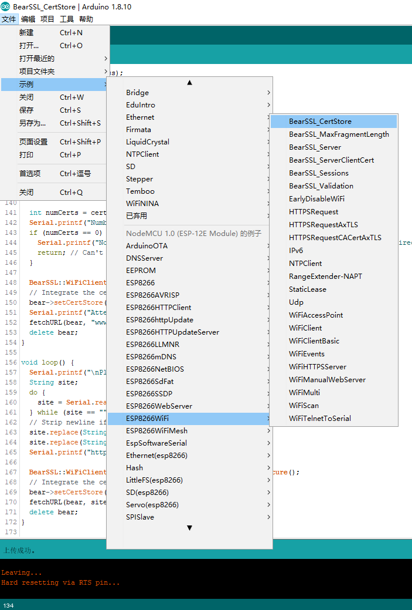
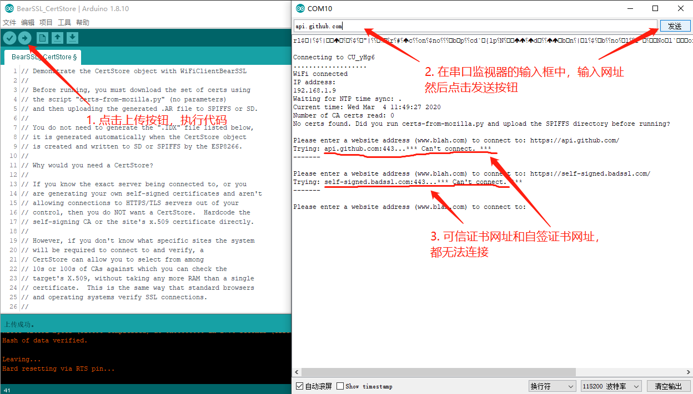
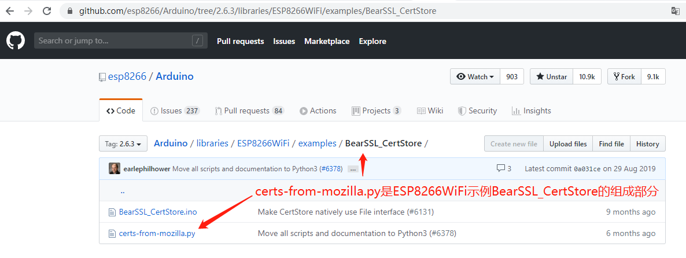
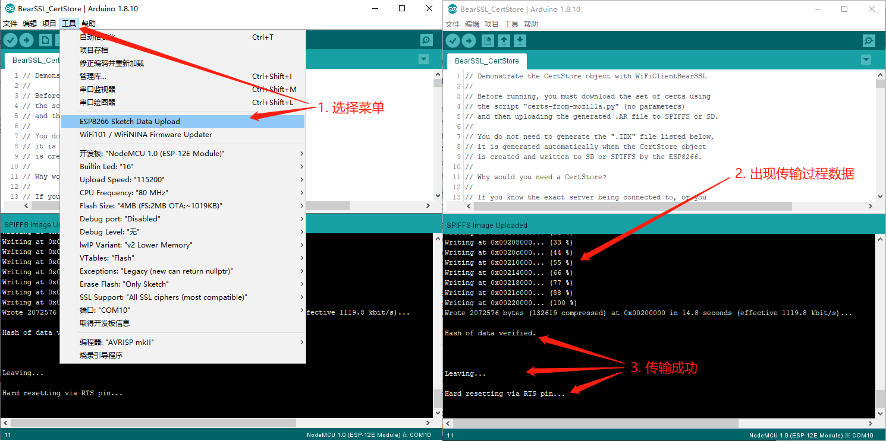
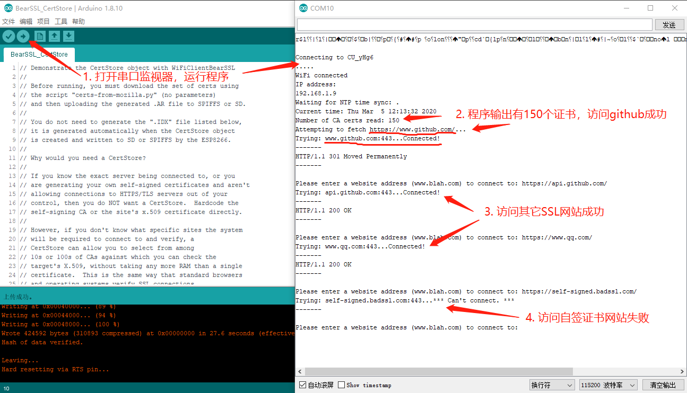
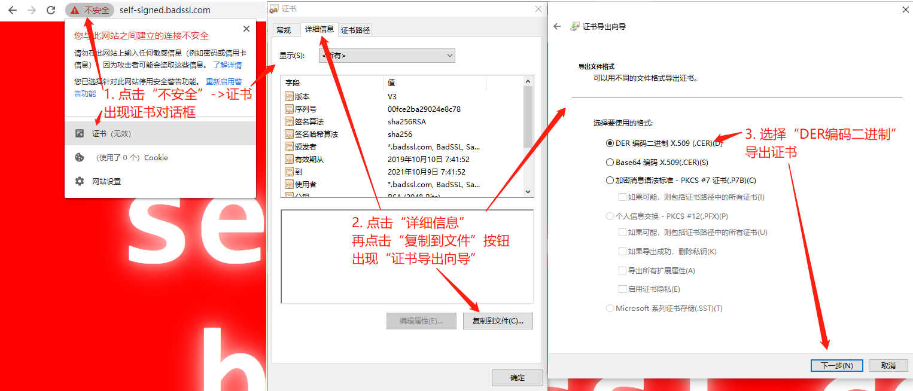
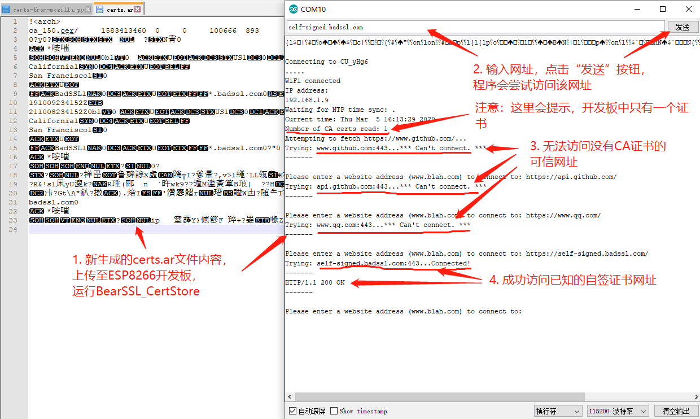

# 使用证书库验证和访问Https网页
[ESP8266访问Https网页](esp8266-wifi-ssl.md)中使用的方法，适合对自签证书网站或指定的https网站时使用。

当被访问的https网站SSL证书能保证有效和可信、而我们不能提前知道要访问哪个网站时，使用证书库来保证访问安全，是更合适的方法。在ESP8266WiFi中，有一个BearSSL_CertStore.ino，是本讲的示例程序。

在Arduino IDE中，选择【文件】->【示例】->【ESP8266WiFi】->【BearSSL_CertStore】，如下图所示：



<br/>

出现代码如下：

```c++
// Demonstrate the CertStore object with WiFiClientBearSSL
//
// Before running, you must download the set of certs using
// the script "certs-from-mozilla.py" (no parameters)
// and then uploading the generated .AR file to SPIFFS or SD.
//
// You do not need to generate the ".IDX" file listed below,
// it is generated automatically when the CertStore object
// is created and written to SD or SPIFFS by the ESP8266.
//
// Why would you need a CertStore?
//
// If you know the exact server being connected to, or you
// are generating your own self-signed certificates and aren't
// allowing connections to HTTPS/TLS servers out of your
// control, then you do NOT want a CertStore.  Hardcode the
// self-signing CA or the site's x.509 certificate directly.
//
// However, if you don't know what specific sites the system
// will be required to connect to and verify, a
// CertStore can allow you to select from among
// 10s or 100s of CAs against which you can check the
// target's X.509, without taking any more RAM than a single
// certificate.  This is the same way that standard browsers
// and operating systems verify SSL connections.
//
// About the chosen certs:
// The certificates are scraped from the Mozilla.org current
// list, but please don't take this as an endorsement or a
// requirement:  it is up to YOU, the USER, to specify the
// certificate authorities you will use as trust bases.
//
// Mar 2018 by Earle F. Philhower, III
// Released to the public domain

#include <ESP8266WiFi.h>
#include <CertStoreBearSSL.h>
#include <time.h>
#include <FS.h>

#ifndef STASSID
#define STASSID "your-ssid"
#define STAPSK  "your-password"
#endif

const char *ssid = STASSID;
const char *pass = STAPSK;

// A single, global CertStore which can be used by all
// connections.  Needs to stay live the entire time any of
// the WiFiClientBearSSLs are present.
BearSSL::CertStore certStore;

// Set time via NTP, as required for x.509 validation
void setClock() {
  configTime(3 * 3600, 0, "pool.ntp.org", "time.nist.gov");

  Serial.print("Waiting for NTP time sync: ");
  time_t now = time(nullptr);
  while (now < 8 * 3600 * 2) {
    delay(500);
    Serial.print(".");
    now = time(nullptr);
  }
  Serial.println("");
  struct tm timeinfo;
  gmtime_r(&now, &timeinfo);
  Serial.print("Current time: ");
  Serial.print(asctime(&timeinfo));
}

// Try and connect using a WiFiClientBearSSL to specified host:port and dump URL
void fetchURL(BearSSL::WiFiClientSecure *client, const char *host, const uint16_t port, const char *path) {
  if (!path) {
    path = "/";
  }

  Serial.printf("Trying: %s:443...", host);
  client->connect(host, port);
  if (!client->connected()) {
    Serial.printf("*** Can't connect. ***\n-------\n");
    return;
  }
  Serial.printf("Connected!\n-------\n");
  client->write("GET ");
  client->write(path);
  client->write(" HTTP/1.0\r\nHost: ");
  client->write(host);
  client->write("\r\nUser-Agent: ESP8266\r\n");
  client->write("\r\n");
  uint32_t to = millis() + 5000;
  if (client->connected()) {
    do {
      char tmp[32];
      memset(tmp, 0, 32);
      int rlen = client->read((uint8_t*)tmp, sizeof(tmp) - 1);
      yield();
      if (rlen < 0) {
        break;
      }
      // Only print out first line up to \r, then abort connection
      char *nl = strchr(tmp, '\r');
      if (nl) {
        *nl = 0;
        Serial.print(tmp);
        break;
      }
      Serial.print(tmp);
    } while (millis() < to);
  }
  client->stop();
  Serial.printf("\n-------\n");
}

void setup() {
  Serial.begin(115200);
  Serial.println();
  Serial.println();

  SPIFFS.begin();
  // If using a SD card or LittleFS, call the appropriate ::begin instead

  // We start by connecting to a WiFi network
  Serial.print("Connecting to ");
  Serial.println(ssid);
  WiFi.mode(WIFI_STA);
  WiFi.begin(ssid, pass);

  while (WiFi.status() != WL_CONNECTED) {
    delay(500);
    Serial.print(".");
  }
  Serial.println("");

  Serial.println("WiFi connected");
  Serial.println("IP address: ");
  Serial.println(WiFi.localIP());

  setClock(); // Required for X.509 validation

  int numCerts = certStore.initCertStore(SPIFFS, PSTR("/certs.idx"), PSTR("/certs.ar"));
  Serial.printf("Number of CA certs read: %d\n", numCerts);
  if (numCerts == 0) {
    Serial.printf("No certs found. Did you run certs-from-mozilla.py and upload the SPIFFS directory before running?\n");
    return; // Can't connect to anything w/o certs!
  }

  BearSSL::WiFiClientSecure *bear = new BearSSL::WiFiClientSecure();
  // Integrate the cert store with this connection
  bear->setCertStore(&certStore);
  Serial.printf("Attempting to fetch https://www.github.com/...\n");
  fetchURL(bear, "www.github.com", 443, "/");
  delete bear;
}

void loop() {
  Serial.printf("\nPlease enter a website address (www.blah.com) to connect to: ");
  String site;
  do {
    site = Serial.readString();
  } while (site == "");
  // Strip newline if present
  site.replace(String("\r"), emptyString);
  site.replace(String("\n"), emptyString);
  Serial.printf("https://%s/\n", site.c_str());

  BearSSL::WiFiClientSecure *bear = new BearSSL::WiFiClientSecure();
  // Integrate the cert store with this connection
  bear->setCertStore(&certStore);
  fetchURL(bear, site.c_str(), 443, "/");
  delete bear;
}
```

<br/>

修改第42、43行的无线路由器ID和密码，在运行代码，访问https网址失败，如下图所示：


<br/>

在串口监视器中，有输出内容是提示CA证书为0：

```
Number of CA certs read: 0
No certs found. Did you run certs-from-mozilla.py and upload the SPIFFS directory before running?
```

<br/>

### certs-form-mozilla.py在哪里？是干什么用的？怎么用？

- **certs-form-mozilla.py在哪里？**
在互联网上搜索，在https://github.com/esp8266/Arduino/tree/2.6.3/libraries/ESP8266WiFi/examples/BearSSL_CertStore 可以看到，certs-form-mozilla.py是示例代码的一部分，如下图所示：



在本地，这个文件会在当前登录用户的AppData目录下，例如：

C:\Users\当前登录用户\AppData\Local\Arduino15\packages\esp8266\hardware\esp8266\2.6.3\libraries\ESP8266WiFi\examples\BearSSL_CertStore

<br/>

- **certs-form-mozilla.py是干什么用的？**

certs-form-mozilla.py是python程序，内容如下：

```python
#!/usr/bin/python3

# This script pulls the list of Mozilla trusted certificate authorities
# from the web at the "mozurl" below, parses the file to grab the PEM
# for each cert, and then generates DER files in a new ./data directory
# Upload these to a SPIFFS filesystem and use the CertManager to parse
# and use them for your outgoing SSL connections.
#
# Script by Earle F. Philhower, III.  Released to the public domain.
from __future__ import print_function
import csv
import os
import sys
from subprocess import Popen, PIPE, call
try:
    from urllib.request import urlopen
except:
    from urllib2 import urlopen
try:
    from StringIO import StringIO
except:
    from io import StringIO

# Mozilla's URL for the CSV file with included PEM certs
mozurl = "https://ccadb-public.secure.force.com/mozilla/IncludedCACertificateReportPEMCSV"

# Load the manes[] and pems[] array from the URL
names = []
pems = []
response = urlopen(mozurl)
csvData = response.read()
if sys.version_info[0] > 2:
    csvData = csvData.decode('utf-8')
csvFile = StringIO(csvData)
csvReader = csv.reader(csvFile)
for row in csvReader:
    names.append(row[0]+":"+row[1]+":"+row[2])
    pems.append(row[30])
del names[0] # Remove headers
del pems[0] # Remove headers

# Try and make ./data, skip if present
try:
    os.mkdir("data")
except:
    pass

derFiles = []
idx = 0
# Process the text PEM using openssl into DER files
for i in range(0, len(pems)):
    certName = "data/ca_%03d.der" % (idx);
    thisPem = pems[i].replace("'", "")
    print(names[i] + " -> " + certName)
    ssl = Popen(['openssl','x509','-inform','PEM','-outform','DER','-out', certName], shell = False, stdin = PIPE)
    pipe = ssl.stdin
    pipe.write(thisPem.encode('utf-8'))
    pipe.close()
    ssl.wait()
    if os.path.exists(certName):
        derFiles.append(certName)
        idx = idx + 1

if os.path.exists("data/certs.ar"):
    os.unlink("data/certs.ar");

arCmd = ['ar', 'q', 'data/certs.ar'] + derFiles;
call( arCmd )

for der in derFiles:
    os.unlink(der)
```

<br/>

**certs-form-mozilla.py代码说明：**

 * 第25行，从mozilla网站下载了一个CA根证书列表文件（详见：https://ccadb-public.secure.force.com/mozilla/IncludedCACertificateReportPEMCSV ）
 * 第44行，在当前目录下创建一个data子目录
 * 第48-61行，将CA根证书列表文件进行解析，每个证书，都在data子目录下存储成一个二进制证书文件。**注意：这里使用了openssl，需要安装了openssl才能使用。**
 * 第67行，将这些二进制证书文件，使用ar命令，打包到data/certs.ar文件中。**注意：这里使用了ar工具，如果你的系统里没有这个工具，安装TDM-GCC即可。**

<br/>

**certs-form-mozilla.py怎么用？**

* 打开DOS窗口，进入certs-form-mozilla.py所在目录，执行certs-form-mozilla.py：

```
python certs-form-mozilla.py
```

 **注意：上面这行命令，需要系统安装了python2或python3。**

 运行后，在当前目录下，会出现data子目录，子目录下有一个certs.ar文件（只有这个文件，过程产生的der文件，都在certs-form-mozilla.py的第70、71行删除了）。

<br/>

### 应用data/certs.ar

##### 上传certs.ar

分析BearSSL_CertStore.ino文件，会看到第141行有用到/certs.ar。这个/certs.ar，是指存储在ESP8266开发板上的文件。通过菜单【工具】->【ESP8266 Sketch Data Upload】，会把当前窗口程序所在目录的data/子目录下的文件，传到ESP8266开发板的根目录下。如下图所示：



<br/>

##### 运行BearSSL_CertStore

运行程序，在有了证书库后，访问可信ssl证书网站成功，访问自签证书网站失败，如下图所示：



<br/>

### 把自签证书加入certs.ar并运行BearSSL_CertStore

##### 以DER编码二进制格式，导出https://self-signed.badssl.com/ 的自签证书，步骤如下图所示：



<br/>

* 在浏览器中访问https://self-signed.badssl.com/ ，点击“不安全”->【证书（无效）】，出现“证书”对话框。
* 在“证书”对话框中，点击“详细信息”，再点击“复制到文件”按钮，出现“证书导出向导”对话框。
* 在“证书导出向导”中，选择“DER编码二进制”，把证书导出到certs-form-mozilla.py所在目录的data子目录下，文件名用ca_150.cer。
* 在Windows DOS窗口中，执行如下certutil命令，校验ca_150.cer的SHA1哈希值，与之前在浏览器证书对话框中显示的[自签证书指纹数据](esp8266-wifi-ssl.md#使用证书指纹验证能访问自签证书过期证书的网站吗)完全一样：

```
certutil -hashfile ca_150.cer sha1
```

上面这行命令会输出如下内容：

```
SHA1 的 ca_150.cer 哈希:
99c1daf07c8d69a8a065492dcaae43c43ff13497
CertUtil: -hashfile 命令成功完成。
```

<br/>

##### 生成只包含ca_150.cer的certs.ar文件，并执行

* 编辑certs-form-mozilla.py，注释掉第61行：

```
#        derFiles.append(certName)
```

* 第63行，修改为如下：

```python
derFiles.append("data/ca_150.cer")
```

* 运行certs-form-mozilla.py，生成新的data/certs.ar：

```
python certs-form-mozilla.py
```

* 用文本编辑器编辑data/certs.ar，将certs.ar上传，并执行，如下图所示：



<br/>

**至此，我们能随意控制哪些CA根证书文件或自签证书文件进入data/certs.ar，以控制Https网址是否可以访问。**

<br/>

### 参考资料
* https://github.com/esp8266/Arduino/blob/2.6.3/libraries/ESP8266WiFi/examples/BearSSL_CertStore/BearSSL_CertStore.ino
* https://github.com/esp8266/Arduino/blob/2.6.3/libraries/ESP8266WiFi/examples/BearSSL_CertStore/certs-from-mozilla.py
* https://ccadb-public.secure.force.com/mozilla/IncludedCACertificateReportPEMCSV
* https://www.runoob.com/linux/linux-comm-ar.html

