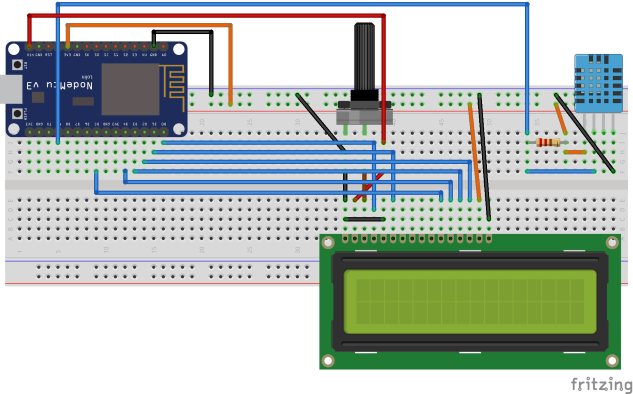
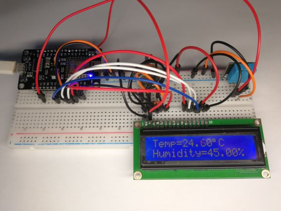
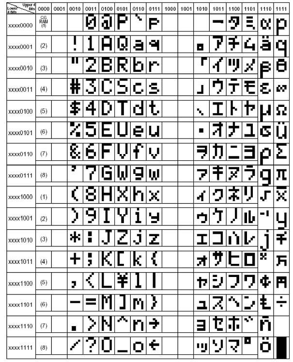
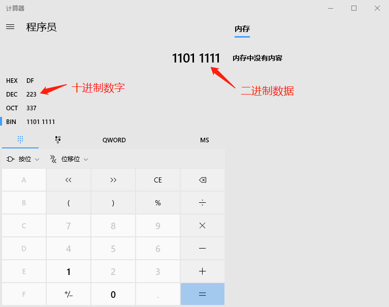

# ESP8266测量和显示温度/湿度

### Fritzing元件图

* [ESP8266 NodeMCU开发板Fritzing元件图](https://github.com/roman-minyaylov/nodemcu-v3-fritzing)，导入其中的NodeMCUv3 Lolin.fzpz文件
* [DHT11元件图](http://fritzing.org/projects/digital-thermometer-with-dht11/)，导入其中的DigitalThermometer.fzz

接线图如下图所示：



<br/>

### ESP8266和Arduino的引脚对应关系表

```
// for ESP8266
#define D0 16
#define D1 5
#define D2 4
#define D3 0
#define D4 2
#define D5 14
#define D6 12
#define D7 13
#define D8 15
#define RX 3 // D9
#define TX 1 // D10
```

<br/>

### ESP8266+DHT11+LCD1602

```c++ {.line-numbers} {highlight=[7-18,25,26,43]}
#include "DHT.h"
#include <LiquidCrystal.h>

// for Arduino
// #define DHTPIN 8

// for ESP8266
#define D0 16
#define D1 5
#define D2 4
#define D3 0
#define D4 2
#define D5 14
#define D6 12
#define D7 13
#define D8 15
#define RX 3 // D9
#define TX 1 // D10

#define DHTPIN RX
#define DHTTYPE DHT11 

DHT dht(DHTPIN, DHTTYPE);

// LiquidCrystal lcd(12, 11, 5, 4, 3, 2);
LiquidCrystal lcd(D0, D1, D2, D3, D4, D5);

void setup() {
  Serial.begin(9600);
  lcd.begin(16, 2);
  dht.begin();
}

void loop() {
  float h = dht.readHumidity();
  float t = dht.readTemperature();
  if (isnan(t) || isnan(h)) {
    Serial.println("Failed to read from DHT");
  } else {
    lcd.setCursor(0, 0);
    lcd.print("Temp=");
    lcd.print(t);
    lcd.write((byte)223);
    lcd.print("C");
    lcd.setCursor(0,1);
    lcd.print("Humidity=");
    lcd.print(h);
    lcd.print("% ");
    Serial.print("Temp=");
    Serial.print(t);
    Serial.println("℃");
    delay(2000);
  }
}
```

代码执行效果如下图所示：



<br/>

### LCD1602显示℃

LCD1602内置了一个小字库，如下图所示：



<br/>

°这个符号在上图的字库表中，高四位是二进制1101，低四位是二进制1111，用Windows自带的计算器，点左侧中间的BIN（二进制），输入11011111，即可看到对应的十进制是223，如下图所示。因此，在代码的第43行，输出了这个°。



<br/>

### 参考资料
* [LCD1602原理说明](​https://www.cnblogs.com/hui088/p/4732034.html)
* [DHT11与LCD1602的使用](https://www.geeetech.com/wiki/index.php/Electric_thermometer_by_using_DHT11_sensor_module)
* [DHT sensor library By Adafruit](https://github.com/adafruit/DHT-sensor-library)
