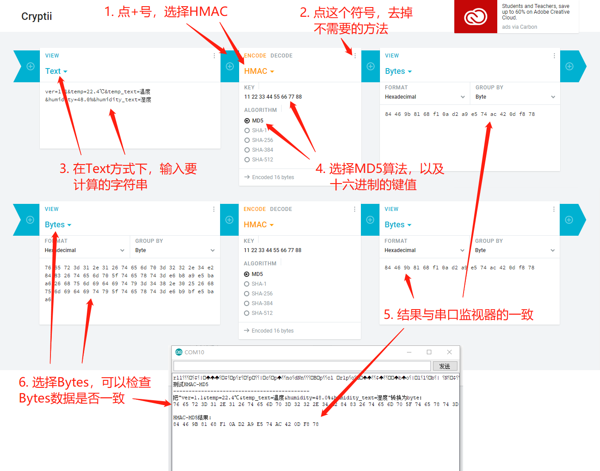

# ESP8266 HMac-MD5

### MD5

ESP8266中有MD5的实现：MD5Builder，示例代码如下：

```c++
void setup() {
  // put your setup code here, to run once:
  Serial.begin(115200);
  Serial.println();
  MD5Builder md5;
  md5.begin();
  md5.add("温度=25.20℃, 湿度=44.00%；");
  md5.calculate();
  Serial.print("MD5:");
  Serial.println(md5.toString());
  Serial.println();
}

void loop() {
  // put your main code here, to run repeatedly:

}
```

执行上述代码，把串口监视器的输出结果，与cryptii.com的结果进行比较，MD5哈希值一致，如下图所示：


<br/>

### HMAC-MD5

HMAC是密钥相关的哈希运算消息认证码（Hash-based Message Authentication Code）的缩写，是在计算哈希值时，使用秘钥，这个秘钥，也叫盐（Salt），所以HMAC-MD5是加密MD5或带盐MD5。

下面是一段参考​https://github.com/Rosmianto/hmac-md5 样例代码：

```c++
String message = "ver=1.1&temp=22.4℃&temp_text=温度&humidity=48.0%&humidity_text=湿度";
byte key[] = { 0x11, 0x22, 0x33, 0x44, 0x55, 0x66, 0x77, 0x88 };

byte result[16];

void setup() {
  Serial.begin(115200);
  Serial.println("HMAC-MD5 Test");

  Serial.println(message.length());
  byte b[message.length()];
  for(int i = 0; i < message.length(); i++) {
    b[i] = message.charAt(i);
    if(b[i] < 0x10) Serial.print('0');
    Serial.print(b[i], HEX);
    Serial.print(' ');
  }
  Serial.println();
  
  hmac_md5(key, sizeof(key), b, sizeof(b), result);

  for(int i = 0; i < 16; i++) {
    byte b = result[i];
    if(b < 0x10) Serial.print('0');
    Serial.print(b, HEX);
    Serial.print(' ');
  }
}

void loop() {

}

void hmac_md5(byte key[], int keyLength, byte msg[], int msgLength, byte result[]) {

  int blockSize = 64;
  byte baKey[64] = { 0x00, 0x00, 0x00, 0x00, 0x00, 0x00, 0x00, 0x00, 0x00, 0x00, 0x00, 0x00, 0x00, 0x00, 0x00, 0x00, 
                     0x00, 0x00, 0x00, 0x00, 0x00, 0x00, 0x00, 0x00, 0x00, 0x00, 0x00, 0x00, 0x00, 0x00, 0x00, 0x00, 
                     0x00, 0x00, 0x00, 0x00, 0x00, 0x00, 0x00, 0x00, 0x00, 0x00, 0x00, 0x00, 0x00, 0x00, 0x00, 0x00,
                     0x00, 0x00, 0x00, 0x00, 0x00, 0x00, 0x00, 0x00, 0x00, 0x00, 0x00, 0x00, 0x00, 0x00, 0x00, 0x00 };
  byte hash_result[16];
  byte baOuterKeyPadded[blockSize];
  byte baInnerKeyPadded[blockSize];
  byte tempHash[16];
  MD5Builder md5;

  if(keyLength > blockSize) {
    md5.begin();
    md5.add(key, keyLength);
    md5.calculate();
    md5.getBytes(baKey);
  }
  else {
    for(int i = 0; i < keyLength; i++) {
      baKey[i] = key[i];
    }
  }

  for (int i = 0; i < blockSize; i++) {
    baOuterKeyPadded[i] = baKey[i] ^ 0x5C;
    baInnerKeyPadded[i] = baKey[i] ^ 0x36;
  }

  // return hash(o_key_pad ∥ hash(i_key_pad ∥ message)) // Where ∥ is concatenation
  md5.begin();
  md5.add(baInnerKeyPadded, blockSize);
  md5.add(msg, msgLength);
  md5.calculate();
  md5.getBytes(tempHash);

  md5.begin();
  md5.add(baOuterKeyPadded, blockSize);
  md5.add(tempHash, 16);
  md5.calculate();
  md5.getBytes(hash_result);

  memcpy(result, hash_result, 16);
}
```

<br/>

代码第1行，是要计算哈希值的内容；第2行，是计算HMAC时使用的秘钥。

执行代码，输出结果与cryptii.com的一致，如下图所示：

 

<br/>

### 参考资料

* MD5Builder.h：https://github.com/esp8266/Arduino/blob/master/cores/esp8266/MD5Builder.h
* MD5Builder.cpp：https://github.com/esp8266/Arduino/blob/master/cores/esp8266/MD5Builder.cpp 
* ESP8266 HMAC-MD5：https://github.com/Rosmianto/hmac-md5
* HMAC介绍：https://baike.baidu.com/item/hmac

