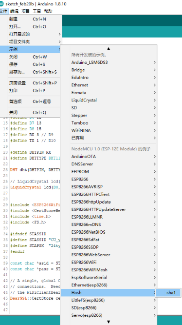
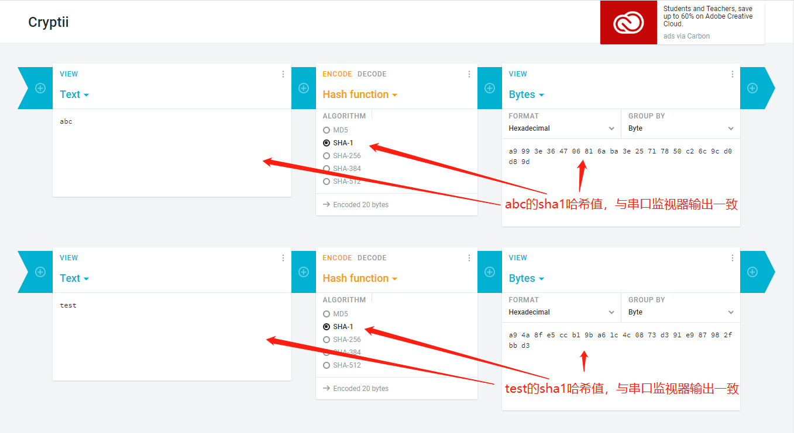
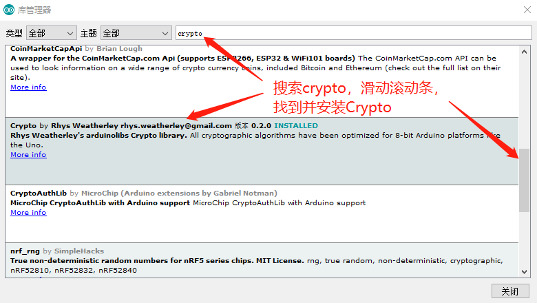
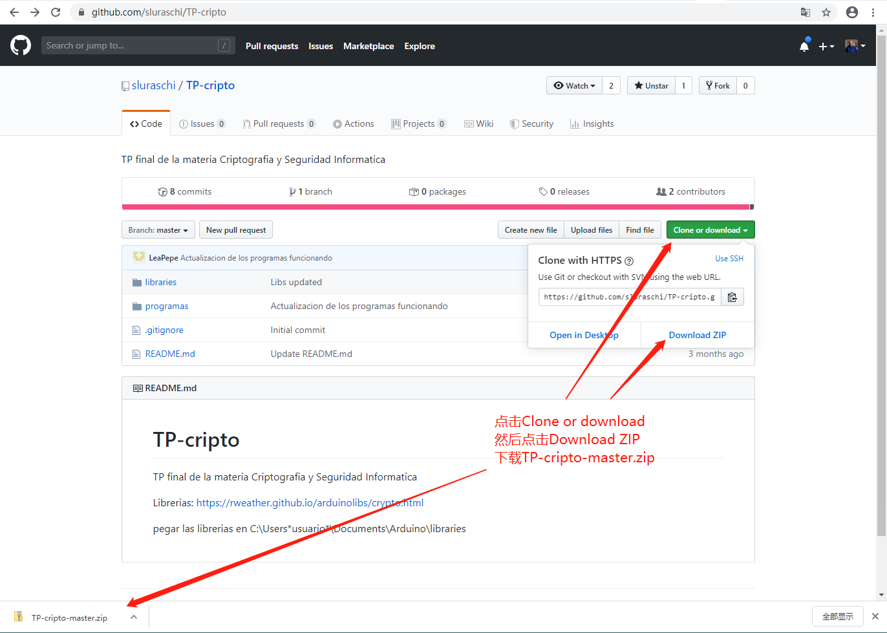
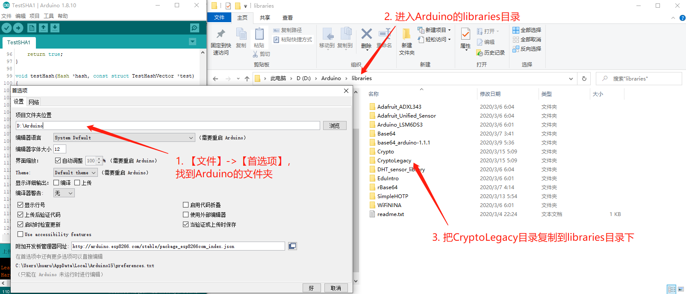
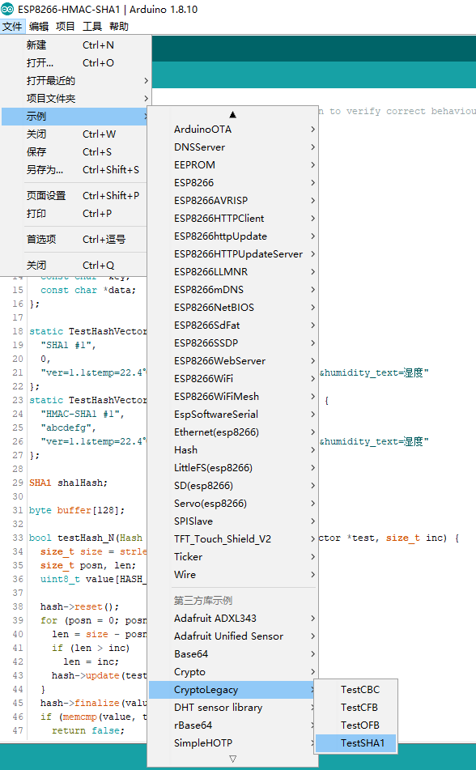
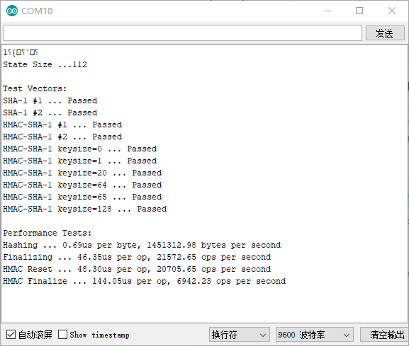
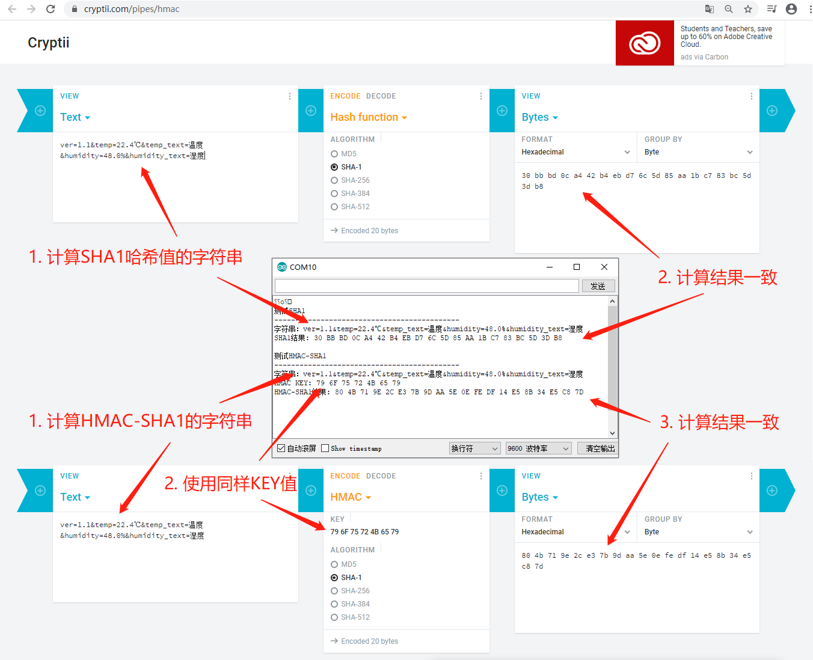

# ESP8266 Hmac-Sha1

### ESP8266自带的Sha1

在ESP8266的核心代码中，带有SHA1的哈希示例代码，点击【文件】->【示例】->【Hash】->【sha1】，即可出现Sha1的示例代码，如下图所示：

 

<br/>

 会出现SHA1的示例文件，如下：

```c++
/**
   simple demo to show sha1 calculation
*/
#include <Arduino.h>
#include <Hash.h>

void setup() {
  Serial.begin(115200);
}

void loop() {

  // usage as String
  // SHA1:a9993e364706816aba3e25717850c26c9cd0d89d

  Serial.print("SHA1:");
  Serial.println(sha1("abc"));

  // usage as ptr
  // SHA1:a94a8fe5ccb19ba61c4c0873d391e987982fbbd3
  uint8_t hash[20];
  sha1("test", &hash[0]);

  Serial.print("SHA1:");
  for (uint16_t i = 0; i < 20; i++) {
    Serial.printf("%02x", hash[i]);
  }
  Serial.println();

  delay(1000);
}
```

<br/>

执行代码，观察abc的哈希值，应与第14行一致，test的哈希值，应与第20行一致。在cryptii.com上验证这两个哈希值，结果一致，如下图所示：



<br/> 

**结论：由于ESP8266自带的Sha1实现中，没有HMAC-SHA1的示例，因此，我们放弃继续使用这个Sha1实现。**

<br/>

### 使用Arduino Cryptography Library实现Sha1和Hmac-Sha1 

##### 安装Crypto和CryptoLegacy 

Arduino Cryptography Library中带有很多有用的密码算法，从随机数，到AES和SHA，再到椭圆算法，非常完整和高质量。

不知为何，Arduino Cryptography Library把SHA1.h和SHA1.cpp放到了CryptoLegacy目录下，并不在安装好的库中，因此，需要自己手工把CryptoLegacy安装到本地库里，步骤如下：

* 在Arduino IDE的库管理中安装Arduino Cryptography Library，如下图所示：

 

<br/>

* 下载https://github.com/sluraschi/TP-cripto/ 为TP-cripto-master.zip，如下图所示： 

 

<br/>

* 将TP-cripto-master.zip解压缩后，将CryptoLegacy复制到Arduino的libraries目录下，如下图所示：

 

<br/>

### CryptoLegecy的TestSHA1示例

重启Arduino IDE，点击菜单【文件】->【示例】->【!CryptoLegacy】->【TestSHA1】，如下图所示：

 

<br/>

出现如下代码：

```c++
/*
 * Copyright (C) 2015 Southern Storm Software, Pty Ltd.
 *
 * Permission is hereby granted, free of charge, to any person obtaining a
 * copy of this software and associated documentation files (the "Software"),
 * to deal in the Software without restriction, including without limitation
 * the rights to use, copy, modify, merge, publish, distribute, sublicense,
 * and/or sell copies of the Software, and to permit persons to whom the
 * Software is furnished to do so, subject to the following conditions:
 *
 * The above copyright notice and this permission notice shall be included
 * in all copies or substantial portions of the Software.
 *
 * THE SOFTWARE IS PROVIDED "AS IS", WITHOUT WARRANTY OF ANY KIND, EXPRESS
 * OR IMPLIED, INCLUDING BUT NOT LIMITED TO THE WARRANTIES OF MERCHANTABILITY,
 * FITNESS FOR A PARTICULAR PURPOSE AND NONINFRINGEMENT. IN NO EVENT SHALL THE
 * AUTHORS OR COPYRIGHT HOLDERS BE LIABLE FOR ANY CLAIM, DAMAGES OR OTHER
 * LIABILITY, WHETHER IN AN ACTION OF CONTRACT, TORT OR OTHERWISE, ARISING
 * FROM, OUT OF OR IN CONNECTION WITH THE SOFTWARE OR THE USE OR OTHER
 * DEALINGS IN THE SOFTWARE.
 */

/*
This example runs tests on the SHA1 implementation to verify correct behaviour.
*/

#include <Crypto.h>
#include <SHA1.h>
#include <string.h>

#define HASH_SIZE 20
#define BLOCK_SIZE 64

struct TestHashVector
{
    const char *name;
    const char *key;
    const char *data;
    uint8_t hash[HASH_SIZE];
};

static TestHashVector const testVectorSHA1_1 = {
    "SHA-1 #1",
    0,
    "abc",
    {0xA9, 0x99, 0x3E, 0x36, 0x47, 0x06, 0x81, 0x6A,
     0xBA, 0x3E, 0x25, 0x71, 0x78, 0x50, 0xC2, 0x6C,
     0x9C, 0xD0, 0xD8, 0x9D}
};
static TestHashVector const testVectorSHA1_2 = {
    "SHA-1 #2",
    0,
    "abcdbcdecdefdefgefghfghighijhijkijkljklmklmnlmnomnopnopq",
    {0x84, 0x98, 0x3E, 0x44, 0x1C, 0x3B, 0xD2, 0x6E,
     0xBA, 0xAE, 0x4A, 0xA1, 0xF9, 0x51, 0x29, 0xE5,
     0xE5, 0x46, 0x70, 0xF1}
};
static TestHashVector const testVectorHMAC_SHA1_1 = {
    "HMAC-SHA-1 #1",
    "",
    "",
    {0xfb, 0xdb, 0x1d, 0x1b, 0x18, 0xaa, 0x6c, 0x08,
     0x32, 0x4b, 0x7d, 0x64, 0xb7, 0x1f, 0xb7, 0x63,
     0x70, 0x69, 0x0e, 0x1d}
};
static TestHashVector const testVectorHMAC_SHA1_2 = {
    "HMAC-SHA-1 #2",
    "key",
    "The quick brown fox jumps over the lazy dog",
    {0xde, 0x7c, 0x9b, 0x85, 0xb8, 0xb7, 0x8a, 0xa6,
     0xbc, 0x8a, 0x7a, 0x36, 0xf7, 0x0a, 0x90, 0x70,
     0x1c, 0x9d, 0xb4, 0xd9}
};

SHA1 sha1;

byte buffer[128];

bool testHash_N(Hash *hash, const struct TestHashVector *test, size_t inc)
{
    size_t size = strlen(test->data);
    size_t posn, len;
    uint8_t value[HASH_SIZE];

    hash->reset();
    for (posn = 0; posn < size; posn += inc) {
        len = size - posn;
        if (len > inc)
            len = inc;
        hash->update(test->data + posn, len);
    }
    hash->finalize(value, sizeof(value));
    if (memcmp(value, test->hash, sizeof(value)) != 0)
        return false;

    return true;
}

void testHash(Hash *hash, const struct TestHashVector *test)
{
    bool ok;

    Serial.print(test->name);
    Serial.print(" ... ");

    ok  = testHash_N(hash, test, strlen(test->data));
    ok &= testHash_N(hash, test, 1);
    ok &= testHash_N(hash, test, 2);
    ok &= testHash_N(hash, test, 5);
    ok &= testHash_N(hash, test, 8);
    ok &= testHash_N(hash, test, 13);
    ok &= testHash_N(hash, test, 16);
    ok &= testHash_N(hash, test, 24);
    ok &= testHash_N(hash, test, 63);
    ok &= testHash_N(hash, test, 64);

    if (ok)
        Serial.println("Passed");
    else
        Serial.println("Failed");
}

// Very simple method for hashing a HMAC inner or outer key.
void hashKey(Hash *hash, const uint8_t *key, size_t keyLen, uint8_t pad)
{
    size_t posn;
    uint8_t buf;
    uint8_t result[HASH_SIZE];
    if (keyLen <= BLOCK_SIZE) {
        hash->reset();
        for (posn = 0; posn < BLOCK_SIZE; ++posn) {
            if (posn < keyLen)
                buf = key[posn] ^ pad;
            else
                buf = pad;
            hash->update(&buf, 1);
        }
    } else {
        hash->reset();
        hash->update(key, keyLen);
        hash->finalize(result, HASH_SIZE);
        hash->reset();
        for (posn = 0; posn < BLOCK_SIZE; ++posn) {
            if (posn < HASH_SIZE)
                buf = result[posn] ^ pad;
            else
                buf = pad;
            hash->update(&buf, 1);
        }
    }
}

void testHMAC(Hash *hash, size_t keyLen)
{
    uint8_t result[HASH_SIZE];

    Serial.print("HMAC-SHA-1 keysize=");
    Serial.print(keyLen);
    Serial.print(" ... ");

    // Construct the expected result with a simple HMAC implementation.
    memset(buffer, (uint8_t)keyLen, keyLen);
    hashKey(hash, buffer, keyLen, 0x36);
    memset(buffer, 0xBA, sizeof(buffer));
    hash->update(buffer, sizeof(buffer));
    hash->finalize(result, HASH_SIZE);
    memset(buffer, (uint8_t)keyLen, keyLen);
    hashKey(hash, buffer, keyLen, 0x5C);
    hash->update(result, HASH_SIZE);
    hash->finalize(result, HASH_SIZE);

    // Now use the library to compute the HMAC.
    hash->resetHMAC(buffer, keyLen);
    memset(buffer, 0xBA, sizeof(buffer));
    hash->update(buffer, sizeof(buffer));
    memset(buffer, (uint8_t)keyLen, keyLen);
    hash->finalizeHMAC(buffer, keyLen, buffer, HASH_SIZE);

    // Check the result.
    if (!memcmp(result, buffer, HASH_SIZE))
        Serial.println("Passed");
    else
        Serial.println("Failed");
}

void testHMAC(Hash *hash, const struct TestHashVector *test)
{
    uint8_t result[HASH_SIZE];

    Serial.print(test->name);
    Serial.print(" ... ");

    hash->resetHMAC(test->key, strlen(test->key));
    hash->update(test->data, strlen(test->data));
    hash->finalizeHMAC(test->key, strlen(test->key), result, sizeof(result));

    if (!memcmp(result, test->hash, HASH_SIZE))
        Serial.println("Passed");
    else
        Serial.println("Failed");
}

void perfHash(Hash *hash)
{
    unsigned long start;
    unsigned long elapsed;
    int count;

    Serial.print("Hashing ... ");

    for (size_t posn = 0; posn < sizeof(buffer); ++posn)
        buffer[posn] = (uint8_t)posn;

    hash->reset();
    start = micros();
    for (count = 0; count < 1000; ++count) {
        hash->update(buffer, sizeof(buffer));
    }
    elapsed = micros() - start;

    Serial.print(elapsed / (sizeof(buffer) * 1000.0));
    Serial.print("us per byte, ");
    Serial.print((sizeof(buffer) * 1000.0 * 1000000.0) / elapsed);
    Serial.println(" bytes per second");
}

void perfFinalize(Hash *hash)
{
    unsigned long start;
    unsigned long elapsed;
    int count;

    Serial.print("Finalizing ... ");

    hash->reset();
    hash->update("abc", 3);
    start = micros();
    for (count = 0; count < 1000; ++count) {
        hash->finalize(buffer, hash->hashSize());
    }
    elapsed = micros() - start;

    Serial.print(elapsed / 1000.0);
    Serial.print("us per op, ");
    Serial.print((1000.0 * 1000000.0) / elapsed);
    Serial.println(" ops per second");
}

void perfHMAC(Hash *hash)
{
    unsigned long start;
    unsigned long elapsed;
    int count;

    Serial.print("HMAC Reset ... ");

    for (size_t posn = 0; posn < sizeof(buffer); ++posn)
        buffer[posn] = (uint8_t)posn;

    start = micros();
    for (count = 0; count < 1000; ++count) {
        hash->resetHMAC(buffer, hash->hashSize());
    }
    elapsed = micros() - start;

    Serial.print(elapsed / 1000.0);
    Serial.print("us per op, ");
    Serial.print((1000.0 * 1000000.0) / elapsed);
    Serial.println(" ops per second");

    Serial.print("HMAC Finalize ... ");

    hash->resetHMAC(buffer, hash->hashSize());
    hash->update("abc", 3);
    start = micros();
    for (count = 0; count < 1000; ++count) {
        hash->finalizeHMAC(buffer, hash->hashSize(), buffer, hash->hashSize());
    }
    elapsed = micros() - start;

    Serial.print(elapsed / 1000.0);
    Serial.print("us per op, ");
    Serial.print((1000.0 * 1000000.0) / elapsed);
    Serial.println(" ops per second");
}

void setup()
{
    Serial.begin(9600);

    Serial.println();

    Serial.print("State Size ...");
    Serial.println(sizeof(SHA1));
    Serial.println();

    Serial.println("Test Vectors:");
    testHash(&sha1, &testVectorSHA1_1);
    testHash(&sha1, &testVectorSHA1_2);
    testHMAC(&sha1, &testVectorHMAC_SHA1_1);
    testHMAC(&sha1, &testVectorHMAC_SHA1_2);
    testHMAC(&sha1, (size_t)0);
    testHMAC(&sha1, 1);
    testHMAC(&sha1, HASH_SIZE);
    testHMAC(&sha1, BLOCK_SIZE);
    testHMAC(&sha1, BLOCK_SIZE + 1);
    testHMAC(&sha1, sizeof(buffer));

    Serial.println();

    Serial.println("Performance Tests:");
    perfHash(&sha1);
    perfFinalize(&sha1);
    perfHMAC(&sha1);
}

void loop()
{
}
```

<br/>

代码第287行至315行，是执行的入口。

执行上述代码，串口监视器输出入下图所示，输出Passed，表示Sha1和Hmac-Sha1运算正确，否则输出的是Failed：

 

<br/>

### 编写ESP8266-HMAC-SHA1 

CryptoLegacy的TestSHA1是个很棒的编写测试用例的样板，对它进行整理后，形成了下面的计算SHA1和HMAC-SHA1的示例代码：

```c++
/*
  Crypto SHA1/HMAC-SHA1 implementation to verify correct behaviour.
*/

#include <Crypto.h>
#include <SHA1.h>
#include <string.h>

#define HASH_SIZE 20

char* message = "ver=1.1&temp=22.4℃&temp_text=温度&humidity=48.0%&humidity_text=湿度";
char* key = "yourKey";

void setup() {
  Serial.begin(9600);
  Serial.println();
  
  Serial.println("测试SHA1");
  Serial.println("--------------------------------------------");
  Serial.print("字符串：");
  Serial.println(message);
  
  uint8_t result[HASH_SIZE];
  crypto_sha1(message, strlen(message), result);
  
  Serial.print("SHA1结果: ");
  for(int i = 0; i < HASH_SIZE; i++) {
    uint8_t b = result[i];
    if(b < 0x10) Serial.print('0');
    Serial.print(b, HEX);
    Serial.print(' ');
  }

  Serial.println();
  Serial.println();
  Serial.println("测试HMAC-SHA1");
  Serial.println("--------------------------------------------");
  Serial.print("字符串：");
  Serial.println(message);
  Serial.print("HMAC KEY: ");
  for(int i = 0; i < strlen(key); i++) {
    uint8_t b = key[i];
    if(b < 0x10) Serial.print('0');
    Serial.print(b, HEX);
    Serial.print(' ');
  }
  Serial.println();

  crypto_hmac_sha1(key, strlen(key), message, strlen(message), result);

  Serial.print("HMAC-SHA1结果: ");
  for(int i = 0; i < HASH_SIZE; i++) {
    byte b = result[i];
    if(b < 0x10) Serial.print('0');
    Serial.print(b, HEX);
    Serial.print(' ');
  }
}

void loop() {

}

void crypto_sha1(char* msg, size_t msgLength, uint8_t* result) {
  uint8_t value[HASH_SIZE];
  SHA1 sha1Hash;
  sha1Hash.reset();
  sha1Hash.update(msg, msgLength);
  sha1Hash.finalize(value, HASH_SIZE);
  memcpy(result, value, HASH_SIZE);
}

void crypto_hmac_sha1(char* key, size_t keyLength, char* msg, size_t msgLength, uint8_t* result) {
  uint8_t value[HASH_SIZE];
  SHA1 sha1Hash;
  sha1Hash.resetHMAC(key, keyLength);
  sha1Hash.update(msg, msgLength);
  sha1Hash.finalizeHMAC(key, keyLength, value, HASH_SIZE);
  memcpy(result, value, HASH_SIZE);
}
```

<br/>

执行上述代码，把串口监视器中的输出与cryptii.com的结果进行比较，完全一致，如下图所示：

 

<br/>

**至此，我们有了一个足够简洁的HMAC-SHA1实现。**

<br/>

### 其它实现 

Github上还有一些SHA1和HMAC-SHA1的实现可以参考和使用，比如参考资料中的发推特信息的代码。

<br/>

**推荐使用CryptoLegacy的方法。** 

<br/>

### 参考资料

* Arduino Cryptography Library文档：https://rweather.github.io/arduinolibs/crypto.html 
* Arduino Cryptography Library源码：https://github.com/sluraschi/TP-cripto 
* CryptoLegacy：https://github.com/sluraschi/TP-cripto/tree/master/libraries/CryptoLegacy 
* https://github.com/soramimi/ESP8266Tweet/blob/master/ESP8266Tweet.ino 

