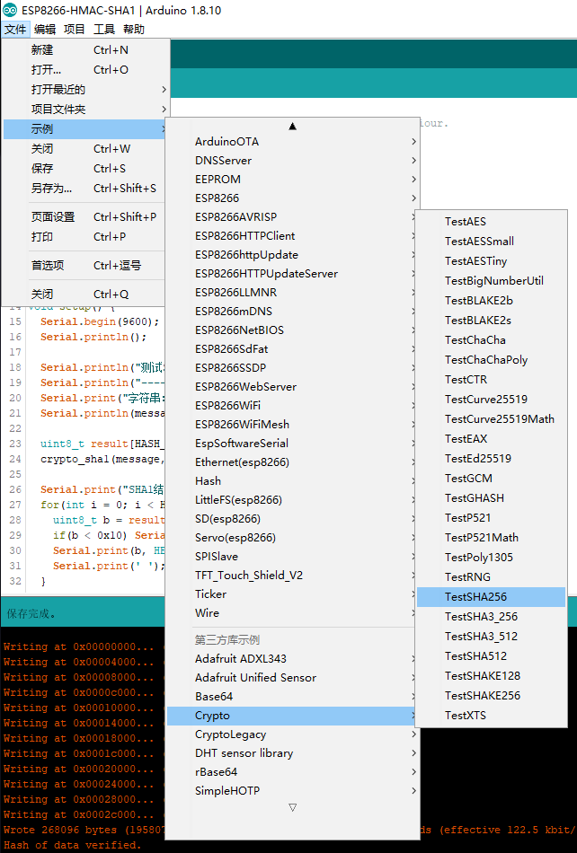
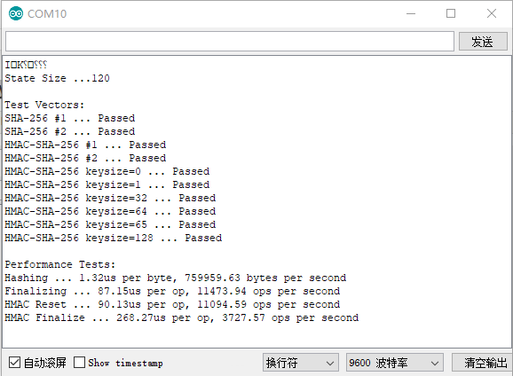
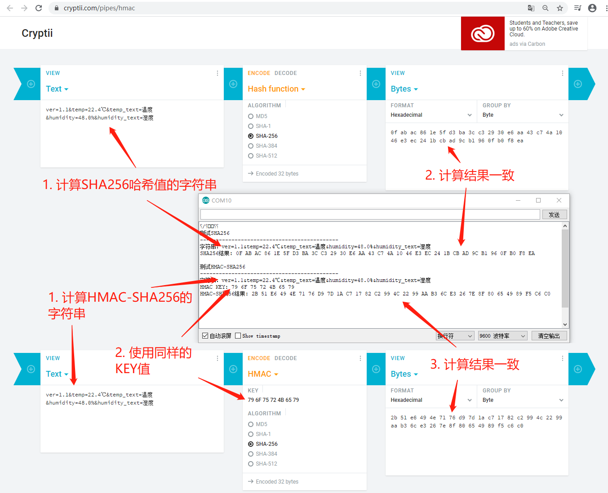

# ESP8266 HMac-Sha256实现

Arduino Cryptography Library中带有Sha256和Hmac-Sha256的实现。下面说明如何使用。

### 检查是否安装了Arduino Cryptography Library 

在Arduino IDE的库管理中安装Arduino Cryptography Library，如下图所示，如果有INSTALLED字样，表示已安装。否则，安装即可。
 

<br/>

### Crypto的TestSHA256示例

在Arduino IDE中，点击菜单【文件】->【示例】->【Crypto】->【TestSHA256】，如下图所示：

 

<br/>

出现如下代码：

```c++
/*
 * Copyright (C) 2015 Southern Storm Software, Pty Ltd.
 *
 * Permission is hereby granted, free of charge, to any person obtaining a
 * copy of this software and associated documentation files (the "Software"),
 * to deal in the Software without restriction, including without limitation
 * the rights to use, copy, modify, merge, publish, distribute, sublicense,
 * and/or sell copies of the Software, and to permit persons to whom the
 * Software is furnished to do so, subject to the following conditions:
 *
 * The above copyright notice and this permission notice shall be included
 * in all copies or substantial portions of the Software.
 *
 * THE SOFTWARE IS PROVIDED "AS IS", WITHOUT WARRANTY OF ANY KIND, EXPRESS
 * OR IMPLIED, INCLUDING BUT NOT LIMITED TO THE WARRANTIES OF MERCHANTABILITY,
 * FITNESS FOR A PARTICULAR PURPOSE AND NONINFRINGEMENT. IN NO EVENT SHALL THE
 * AUTHORS OR COPYRIGHT HOLDERS BE LIABLE FOR ANY CLAIM, DAMAGES OR OTHER
 * LIABILITY, WHETHER IN AN ACTION OF CONTRACT, TORT OR OTHERWISE, ARISING
 * FROM, OUT OF OR IN CONNECTION WITH THE SOFTWARE OR THE USE OR OTHER
 * DEALINGS IN THE SOFTWARE.
 */

/*
This example runs tests on the SHA256 implementation to verify correct behaviour.
*/

#include <Crypto.h>
#include <SHA256.h>
#include <string.h>

#define HASH_SIZE 32
#define BLOCK_SIZE 64

struct TestHashVector
{
    const char *name;
    const char *key;
    const char *data;
    uint8_t hash[HASH_SIZE];
};

static TestHashVector const testVectorSHA256_1 = {
    "SHA-256 #1",
    0,
    "abc",
    {0xba, 0x78, 0x16, 0xbf, 0x8f, 0x01, 0xcf, 0xea,
     0x41, 0x41, 0x40, 0xde, 0x5d, 0xae, 0x22, 0x23,
     0xb0, 0x03, 0x61, 0xa3, 0x96, 0x17, 0x7a, 0x9c,
     0xb4, 0x10, 0xff, 0x61, 0xf2, 0x00, 0x15, 0xad}
};
static TestHashVector const testVectorSHA256_2 = {
    "SHA-256 #2",
    0,
    "abcdbcdecdefdefgefghfghighijhijkijkljklmklmnlmnomnopnopq",
    {0x24, 0x8d, 0x6a, 0x61, 0xd2, 0x06, 0x38, 0xb8,
     0xe5, 0xc0, 0x26, 0x93, 0x0c, 0x3e, 0x60, 0x39,
     0xa3, 0x3c, 0xe4, 0x59, 0x64, 0xff, 0x21, 0x67,
     0xf6, 0xec, 0xed, 0xd4, 0x19, 0xdb, 0x06, 0xc1}
};
static TestHashVector const testVectorHMAC_SHA256_1 = {
    "HMAC-SHA-256 #1",
    "",
    "",
    {0xb6, 0x13, 0x67, 0x9a, 0x08, 0x14, 0xd9, 0xec,
     0x77, 0x2f, 0x95, 0xd7, 0x78, 0xc3, 0x5f, 0xc5,
     0xff, 0x16, 0x97, 0xc4, 0x93, 0x71, 0x56, 0x53,
     0xc6, 0xc7, 0x12, 0x14, 0x42, 0x92, 0xc5, 0xad}
};
static TestHashVector const testVectorHMAC_SHA256_2 = {
    "HMAC-SHA-256 #2",
    "key",
    "The quick brown fox jumps over the lazy dog",
    {0xf7, 0xbc, 0x83, 0xf4, 0x30, 0x53, 0x84, 0x24,
     0xb1, 0x32, 0x98, 0xe6, 0xaa, 0x6f, 0xb1, 0x43,
     0xef, 0x4d, 0x59, 0xa1, 0x49, 0x46, 0x17, 0x59,
     0x97, 0x47, 0x9d, 0xbc, 0x2d, 0x1a, 0x3c, 0xd8}
};

SHA256 sha256;

byte buffer[128];

bool testHash_N(Hash *hash, const struct TestHashVector *test, size_t inc)
{
    size_t size = strlen(test->data);
    size_t posn, len;
    uint8_t value[HASH_SIZE];

    hash->reset();
    for (posn = 0; posn < size; posn += inc) {
        len = size - posn;
        if (len > inc)
            len = inc;
        hash->update(test->data + posn, len);
    }
    hash->finalize(value, sizeof(value));
    if (memcmp(value, test->hash, sizeof(value)) != 0)
        return false;

    return true;
}

void testHash(Hash *hash, const struct TestHashVector *test)
{
    bool ok;

    Serial.print(test->name);
    Serial.print(" ... ");

    ok  = testHash_N(hash, test, strlen(test->data));
    ok &= testHash_N(hash, test, 1);
    ok &= testHash_N(hash, test, 2);
    ok &= testHash_N(hash, test, 5);
    ok &= testHash_N(hash, test, 8);
    ok &= testHash_N(hash, test, 13);
    ok &= testHash_N(hash, test, 16);
    ok &= testHash_N(hash, test, 24);
    ok &= testHash_N(hash, test, 63);
    ok &= testHash_N(hash, test, 64);

    if (ok)
        Serial.println("Passed");
    else
        Serial.println("Failed");
}

// Very simple method for hashing a HMAC inner or outer key.
void hashKey(Hash *hash, const uint8_t *key, size_t keyLen, uint8_t pad)
{
    size_t posn;
    uint8_t buf;
    uint8_t result[HASH_SIZE];
    if (keyLen <= BLOCK_SIZE) {
        hash->reset();
        for (posn = 0; posn < BLOCK_SIZE; ++posn) {
            if (posn < keyLen)
                buf = key[posn] ^ pad;
            else
                buf = pad;
            hash->update(&buf, 1);
        }
    } else {
        hash->reset();
        hash->update(key, keyLen);
        hash->finalize(result, HASH_SIZE);
        hash->reset();
        for (posn = 0; posn < BLOCK_SIZE; ++posn) {
            if (posn < HASH_SIZE)
                buf = result[posn] ^ pad;
            else
                buf = pad;
            hash->update(&buf, 1);
        }
    }
}

void testHMAC(Hash *hash, size_t keyLen)
{
    uint8_t result[HASH_SIZE];

    Serial.print("HMAC-SHA-256 keysize=");
    Serial.print(keyLen);
    Serial.print(" ... ");

    // Construct the expected result with a simple HMAC implementation.
    memset(buffer, (uint8_t)keyLen, keyLen);
    hashKey(hash, buffer, keyLen, 0x36);
    memset(buffer, 0xBA, sizeof(buffer));
    hash->update(buffer, sizeof(buffer));
    hash->finalize(result, HASH_SIZE);
    memset(buffer, (uint8_t)keyLen, keyLen);
    hashKey(hash, buffer, keyLen, 0x5C);
    hash->update(result, HASH_SIZE);
    hash->finalize(result, HASH_SIZE);

    // Now use the library to compute the HMAC.
    hash->resetHMAC(buffer, keyLen);
    memset(buffer, 0xBA, sizeof(buffer));
    hash->update(buffer, sizeof(buffer));
    memset(buffer, (uint8_t)keyLen, keyLen);
    hash->finalizeHMAC(buffer, keyLen, buffer, HASH_SIZE);

    // Check the result.
    if (!memcmp(result, buffer, HASH_SIZE))
        Serial.println("Passed");
    else
        Serial.println("Failed");
}

void testHMAC(Hash *hash, const struct TestHashVector *test)
{
    uint8_t result[HASH_SIZE];

    Serial.print(test->name);
    Serial.print(" ... ");

    hash->resetHMAC(test->key, strlen(test->key));
    hash->update(test->data, strlen(test->data));
    hash->finalizeHMAC(test->key, strlen(test->key), result, sizeof(result));

    if (!memcmp(result, test->hash, HASH_SIZE))
        Serial.println("Passed");
    else
        Serial.println("Failed");
}

void perfHash(Hash *hash)
{
    unsigned long start;
    unsigned long elapsed;
    int count;

    Serial.print("Hashing ... ");

    for (size_t posn = 0; posn < sizeof(buffer); ++posn)
        buffer[posn] = (uint8_t)posn;

    hash->reset();
    start = micros();
    for (count = 0; count < 500; ++count) {
        hash->update(buffer, sizeof(buffer));
    }
    elapsed = micros() - start;

    Serial.print(elapsed / (sizeof(buffer) * 500.0));
    Serial.print("us per byte, ");
    Serial.print((sizeof(buffer) * 500.0 * 1000000.0) / elapsed);
    Serial.println(" bytes per second");
}

void perfFinalize(Hash *hash)
{
    unsigned long start;
    unsigned long elapsed;
    int count;

    Serial.print("Finalizing ... ");

    hash->reset();
    hash->update("abc", 3);
    start = micros();
    for (count = 0; count < 1000; ++count) {
        hash->finalize(buffer, hash->hashSize());
    }
    elapsed = micros() - start;

    Serial.print(elapsed / 1000.0);
    Serial.print("us per op, ");
    Serial.print((1000.0 * 1000000.0) / elapsed);
    Serial.println(" ops per second");
}

void perfHMAC(Hash *hash)
{
    unsigned long start;
    unsigned long elapsed;
    int count;

    Serial.print("HMAC Reset ... ");

    for (size_t posn = 0; posn < sizeof(buffer); ++posn)
        buffer[posn] = (uint8_t)posn;

    start = micros();
    for (count = 0; count < 1000; ++count) {
        hash->resetHMAC(buffer, hash->hashSize());
    }
    elapsed = micros() - start;

    Serial.print(elapsed / 1000.0);
    Serial.print("us per op, ");
    Serial.print((1000.0 * 1000000.0) / elapsed);
    Serial.println(" ops per second");

    Serial.print("HMAC Finalize ... ");

    hash->resetHMAC(buffer, hash->hashSize());
    hash->update("abc", 3);
    start = micros();
    for (count = 0; count < 1000; ++count) {
        hash->finalizeHMAC(buffer, hash->hashSize(), buffer, hash->hashSize());
    }
    elapsed = micros() - start;

    Serial.print(elapsed / 1000.0);
    Serial.print("us per op, ");
    Serial.print((1000.0 * 1000000.0) / elapsed);
    Serial.println(" ops per second");
}

void setup()
{
    Serial.begin(9600);

    Serial.println();

    Serial.print("State Size ...");
    Serial.println(sizeof(SHA256));
    Serial.println();

    Serial.println("Test Vectors:");
    testHash(&sha256, &testVectorSHA256_1);
    testHash(&sha256, &testVectorSHA256_2);
    testHMAC(&sha256, &testVectorHMAC_SHA256_1);
    testHMAC(&sha256, &testVectorHMAC_SHA256_2);
    testHMAC(&sha256, (size_t)0);
    testHMAC(&sha256, 1);
    testHMAC(&sha256, HASH_SIZE);
    testHMAC(&sha256, BLOCK_SIZE);
    testHMAC(&sha256, BLOCK_SIZE + 1);
    testHMAC(&sha256, sizeof(buffer));

    Serial.println();

    Serial.println("Performance Tests:");
    perfHash(&sha256);
    perfFinalize(&sha256);
    perfHMAC(&sha256);
}

void loop()
{
}
```

<br/>

代码第291行至319行，是执行的入口。

执行上述代码，串口监视器输出入下图所示，输出Passed，表示Sha256和Hmac-Sha256运算正确，否则输出的是Failed：

 

<br/>

### 编写ESP8266-HMAC-SHA256 

与Hmac-Sha1类似，编写一个基于Crypto的简洁ESP8266-HMAC-SHA256实现，便于下一步使用，代码如下：

```c++
/*
  Crypto SHA256/HMAC-SHA256 implementation to verify correct behaviour.
*/

#include <Crypto.h>
#include <SHA256.h>
#include <string.h>

#define HASH_SIZE 32

char* message = "ver=1.1&temp=22.4℃&temp_text=温度&humidity=48.0%&humidity_text=湿度";
char* key = "yourKey";

void setup() {
  Serial.begin(9600);
  Serial.println();
  
  Serial.println("测试SHA256");
  Serial.println("--------------------------------------------");
  Serial.print("字符串：");
  Serial.println(message);
  
  uint8_t result[HASH_SIZE];
  crypto_sha256(message, strlen(message), result);
  
  Serial.print("SHA256结果: ");
  for(int i = 0; i < HASH_SIZE; i++) {
    uint8_t b = result[i];
    if(b < 0x10) Serial.print('0');
    Serial.print(b, HEX);
    Serial.print(' ');
  }

  Serial.println();
  Serial.println();
  Serial.println("测试HMAC-SHA256");
  Serial.println("--------------------------------------------");
  Serial.print("字符串：");
  Serial.println(message);
  Serial.print("HMAC KEY: ");
  for(int i = 0; i < strlen(key); i++) {
    uint8_t b = key[i];
    if(b < 0x10) Serial.print('0');
    Serial.print(b, HEX);
    Serial.print(' ');
  }
  Serial.println();

  crypto_hmac_sha256(key, strlen(key), message, strlen(message), result);

  Serial.print("HMAC-SHA256结果: ");
  for(int i = 0; i < HASH_SIZE; i++) {
    byte b = result[i];
    if(b < 0x10) Serial.print('0');
    Serial.print(b, HEX);
    Serial.print(' ');
  }
}

void loop() {

}

void crypto_sha256(char* msg, size_t msgLength, uint8_t* result) {
  uint8_t value[HASH_SIZE];
  SHA256 sha256Hash;
  sha256Hash.reset();
  sha256Hash.update(msg, msgLength);
  sha256Hash.finalize(value, HASH_SIZE);
  memcpy(result, value, HASH_SIZE);
}

void crypto_hmac_sha256(char* key, size_t keyLength, char* msg, size_t msgLength, uint8_t* result) {
  uint8_t value[HASH_SIZE];
  SHA256 sha256Hash;
  sha256Hash.resetHMAC(key, keyLength);
  sha256Hash.update(msg, msgLength);
  sha256Hash.finalizeHMAC(key, keyLength, value, HASH_SIZE);
  memcpy(result, value, HASH_SIZE);
}
```

<br/>

执行上述代码，把串口监视器中的输出与cryptii.com的结果进行比较，完全一致，如下图所示：


<br/> 

**至此，我们有了一个足够简洁的HMAC-SHA256实现。** 

<br/>

### 参考资料 

* Arduino Cryptography Library文档：https://rweather.github.io/arduinolibs/crypto.html 
* Arduino Cryptography Library源码：https://github.com/sluraschi/TP-cripto 

