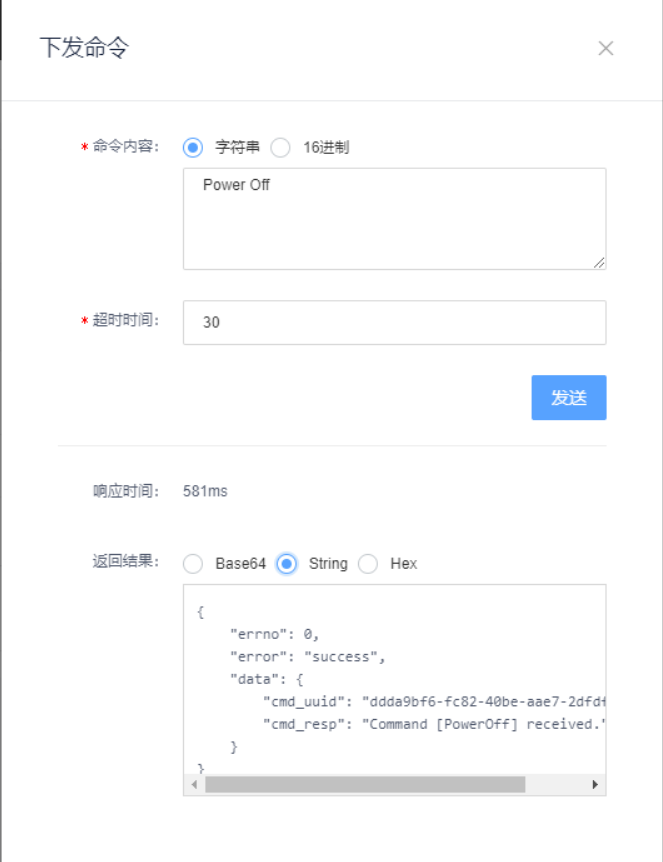

# ESP8266接受OneNET MQTTS命令

本节是说明ESP8266如何接收和响应OneNET MQTTS命令，设计的场景ESP8266每10秒向OneNET提交一次温度和湿度数据，同时接收OneNET上下发的命令，做出响应，并反馈给OneNET。

接收的命令有三个：

1. PowerOn：伺服电机（Micro Servo 9G）转到180度位置。
2. PowerOff：伺服电机转到90度位置。
3. MotorAngle：返回伺服电机当前角度数。

<br/>

### 伺服电机SG90接线

SG90有三根线，红色接5V，棕色接地，橘黄色我接在了D6。

<br/>

### 代码说明

下面的代码是在[ESP8266发布/订阅OneNET MQTTS](esp8266-onenet-mqtts-pubsub.md)基础上修改的：

```c++
#include <ESP8266WiFi.h>
#include <WiFiClientSecure.h>
#include <time.h>
#include <sstream>

#include <libb64/cencode.h>
#include <libb64/cdecode.h>

#include <Crypto.h>
#include <SHA256.h>
#include <string.h>

#include <PubSubClient.h>

#include "DHT.h"
#include <LiquidCrystal.h>

#include <Servo.h>

// for ESP8266
#define D0 16
#define D1 5
#define D2 4
#define D3 0
#define D4 2
#define D5 14
#define D6 12
#define D7 13
#define D8 15
#define RX 3 // D9
#define TX 1 // D10

#define DHTPIN RX
#define DHTTYPE DHT11 

DHT dht(DHTPIN, DHTTYPE);

// LiquidCrystal lcd(12, 11, 5, 4, 3, 2);
LiquidCrystal lcd(D0, D1, D2, D3, D4, D5);

Servo servo;

#define HASH_SIZE 32

#ifndef STASSID
#define STASSID "ssid"
#define STAPSK  "password"
#endif

const char *ssid = STASSID;
const char *pass = STAPSK;

#define base64_alphabet "ABCDEFGHIJKLMNOPQRSTUVWXYZabcdefghijklmnopqrstuvwxyz0123456789+/"
#define base64_padding '='

#define SIZE 100
#define ONENET_CLIENT_ID "ESP8266_01"     // 设备名称
#define ONENET_USERNAME "321016"          // 平台分配的产品ID
#define ONENET_MQTT_VERSION "2018-10-31"
#define ONENET_MQTT_METHOD "sha256"
#define DEFAULT_EXPIRE_IN_SECONDS 86400   // 24小时
#define ONENET_DEVICE_KEY "5XHGxLb9Rr25t5po+Y3c/mtqiS6ArjsLtzk/sS/D5x8="

IPAddress mqtt_ip(183, 230, 40, 16);
#define ONENET_SERVER "183.230.40.16"
#define ONENET_SERVER_PORT 8883

static const char cacert[] PROGMEM = R"EOF(
-----BEGIN CERTIFICATE-----
MIIDOzCCAiOgAwIBAgIJAPCCNfxANtVEMA0GCSqGSIb3DQEBCwUAMDQxCzAJBgNV
BAYTAkNOMQ4wDAYDVQQKDAVDTUlPVDEVMBMGA1UEAwwMT25lTkVUIE1RVFRTMB4X
DTE5MDUyOTAxMDkyOFoXDTQ5MDUyMTAxMDkyOFowNDELMAkGA1UEBhMCQ04xDjAM
BgNVBAoMBUNNSU9UMRUwEwYDVQQDDAxPbmVORVQgTVFUVFMwggEiMA0GCSqGSIb3
DQEBAQUAA4IBDwAwggEKAoIBAQC/VvJ6lGWfy9PKdXKBdzY83OERB35AJhu+9jkx
5d4SOtZScTe93Xw9TSVRKrFwu5muGgPusyAlbQnFlZoTJBZY/745MG6aeli6plpR
r93G6qVN5VLoXAkvqKslLZlj6wXy70/e0GC0oMFzqSP0AY74icANk8dUFB2Q8usS
UseRafNBcYfqACzF/Wa+Fu/upBGwtl7wDLYZdCm3KNjZZZstvVB5DWGnqNX9HkTl
U9NBMS/7yph3XYU3mJqUZxryb8pHLVHazarNRppx1aoNroi+5/t3Fx/gEa6a5PoP
ouH35DbykmzvVE67GUGpAfZZtEFE1e0E/6IB84PE00llvy3pAgMBAAGjUDBOMB0G
A1UdDgQWBBTTi/q1F2iabqlS7yEoX1rbOsz5GDAfBgNVHSMEGDAWgBTTi/q1F2ia
bqlS7yEoX1rbOsz5GDAMBgNVHRMEBTADAQH/MA0GCSqGSIb3DQEBCwUAA4IBAQAL
aqJ2FgcKLBBHJ8VeNSuGV2cxVYH1JIaHnzL6SlE5q7MYVg+Ofbs2PRlTiWGMazC7
q5RKVj9zj0z/8i3ScWrWXFmyp85ZHfuo/DeK6HcbEXJEOfPDvyMPuhVBTzuBIRJb
41M27NdIVCdxP6562n6Vp0gbE8kN10q+ksw8YBoLFP0D1da7D5WnSV+nwEIP+F4a
3ZX80bNt6tRj9XY0gM68mI60WXrF/qYL+NUz+D3Lw9bgDSXxpSN8JGYBR85BxBvR
NNAhsJJ3yoAvbPUQ4m8J/CoVKKgcWymS1pvEHmF47pgzbbjm5bdthlIx+swdiGFa
WzdhzTYwVkxBaU+xf/2w
-----END CERTIFICATE-----
)EOF";

WiFiClientSecure client; 
PubSubClient mqttclient(client);
X509List cert(cacert);
char onenet_token[1024];
char pub_topic[1024];
char pub_json[1024];
char sub_accepted_topic[1024];
char sub_rejected_topic[1024];
char sub_cmd_topic[1024];
int topic_counter = 0;

void callback(char* topic, byte* payload, unsigned int length) {
  Serial.print("Message arrived [");
  Serial.print(topic);
  Serial.print("]: ");
  char receivedChar[length + 1];
  for (int i=0; i < length; i++) {
    receivedChar[i] = (char)payload[i];
    Serial.print(receivedChar[i]);
  }
  receivedChar[length] = '\0';
  std::string topicString = topic;
  std::string::size_type idx = topicString.find("/cmd/request/");
  if (idx != std::string::npos) {
    // 13 is the length of /cmd/request/
    std::string cmdId = topicString.substr(idx + 13);
    Serial.print(" ... comId: ");
    Serial.println(cmdId.c_str());
    // publish a response that command received
    char cmdResTopic[1024];
    getOnenetCmdResTopic(cmdResTopic, cmdId);
    char cmdResPayload[1024];
    generateOnenetCmdResPayload(cmdResPayload, receivedChar);
    Serial.print("Publish [");
    Serial.print(cmdResTopic);
    Serial.print("]: ");
    Serial.println(cmdResPayload);
    mqttclient.publish(cmdResTopic, cmdResPayload);

    if (strcmp(receivedChar, "PowerOn") == 0) {
      servo.write(180);
    } else if (strcmp(receivedChar, "PowerOff") == 0) {
      servo.write(90);
    }
  } else {
    Serial.println();
  }
}

void setup() {
  Serial.begin(115200);
  // 初始化LCD和DHT11
  lcd.begin(16, 2);
  dht.begin();

  // SG90控制线接在D6
  servo.attach(D6);

  Serial.println();
  Serial.println();

  // We start by connecting to a WiFi network
  Serial.print("Connecting to ");
  Serial.println(ssid);
  WiFi.mode(WIFI_STA);
  WiFi.begin(ssid, pass);

  while (WiFi.status() != WL_CONNECTED) {
    delay(500);
    Serial.print(".");
  }
  Serial.println("");

  Serial.println("WiFi connected");
  Serial.print("IP address: ");
  Serial.println(WiFi.localIP());

  setClock();

  delay(1000);
  Serial.println("");
  time_t now = time(nullptr);
  Serial.print("Current time in seconds: ");
  Serial.println(now);

  time_t expire_time = now + DEFAULT_EXPIRE_IN_SECONDS;
  Serial.print("Expire time in seconds:  ");
  Serial.println(expire_time);
  Serial.println();

  // 要计算哈希值的字符串
  std::stringstream ss;
  ss << "products/" << ONENET_USERNAME << "/devices/" << ONENET_CLIENT_ID;
  char* temp = &*ss.str().begin();
  char resource[strlen(temp)];
  memcpy(resource, temp, strlen(temp) + 1);
  *temp = 0;
  ss.clear();
  ss.str("");
  ss << expire_time << '\n'
     << ONENET_MQTT_METHOD << '\n'
     << resource << '\n'
     << ONENET_MQTT_VERSION;
  Serial.print("String for signature (");
  temp = &*ss.str().begin();
  char stringForSign[strlen(temp)];
  memcpy(stringForSign, temp, strlen(temp) + 1);
  ss.str("");
  *temp = 0;
  Serial.print(strlen(stringForSign));
  Serial.println("):");
  Serial.println(stringForSign);
  Serial.println();

  // 得到key_string
  char* key_string = decode(ONENET_DEVICE_KEY);
  Serial.print("Decoded key string(");
  Serial.print(strlen(key_string));
  Serial.println("):");
  Serial.println(key_string);
  Serial.println();

  // 得到key_bytes
  byte key_bytes[strlen(key_string)];
  Serial.println("Decoded key bytes: ");
  for(int i = 0; i < strlen(key_string); i++) {
    key_bytes[i] = key_string[i];
    if(key_bytes[i] < 0x10) Serial.print('0');
    Serial.print(key_bytes[i], HEX);
    Serial.print(' ');
  }
  Serial.println();
  Serial.println();

  // 得到hmac_sha256
  uint8_t hmac_result_bytes[HASH_SIZE];
  crypto_hmac_sha256(key_string, strlen(key_string), stringForSign, strlen(stringForSign), hmac_result_bytes);
  Serial.println("HMac-SHA256 bytes:");
  for(int i = 0; i < HASH_SIZE; i++) {
    uint8_t b = hmac_result_bytes[i];
    if(b < 0x10) Serial.print('0');
    Serial.print(b, HEX);
    Serial.print(' ');
  }
  Serial.println();
  Serial.println();

  char encoded_hmac_result[SIZE];
  base64_string_from_bytes(hmac_result_bytes, sizeof(hmac_result_bytes), encoded_hmac_result);
  Serial.println("Encoded HMac-SHA256 string: ");
  Serial.println(encoded_hmac_result);
  Serial.println();
  Serial.println();

  // 生成password
  ss.clear();
  ss.str("");
  char resource_url_encoded[SIZE];
  url_encode(resource, strlen(resource), resource_url_encoded);
  char hmac_url_encoded[SIZE];
  url_encode(encoded_hmac_result, strlen(encoded_hmac_result), hmac_url_encoded);
  ss << "version=" << ONENET_MQTT_VERSION
     << "&res=" << resource_url_encoded
     << "&et=" << expire_time
     << "&method=" << ONENET_MQTT_METHOD
     << "&sign=" << hmac_url_encoded;
  Serial.println("OneNET password: ");
  temp = &*ss.str().begin();
  onenet_token[strlen(temp)];
  memcpy(onenet_token, temp, strlen(temp) + 1);
  Serial.println(onenet_token);
  ss.clear();
  ss.str("");

  // client.setInsecure();
  client.setTrustAnchors(&cert);
  setClock();

  // 配置MQTT客户端
  // mqttclient.setServer(ONENET_SERVER, ONENET_SERVER_PORT);
  mqttclient.setServer(mqtt_ip, ONENET_SERVER_PORT);
  mqttclient.setKeepAlive(60);
  mqttclient.setSocketTimeout(30);
  mqttclient.setCallback(callback);

  getOnenetPubtopic(pub_topic);
  getOnenetSubtopic(sub_accepted_topic, sub_rejected_topic);
  getOnenetCmdtopic(sub_cmd_topic);
}

void loop() {
  time_t now = time(nullptr);
  float h = dht.readHumidity();
  float t = dht.readTemperature();
  if (isnan(t) || isnan(h)) {
    Serial.println("Failed to read from DHT");
  } else {
    lcd.setCursor(0, 0);
    lcd.print("Temp=");
    lcd.print(t);
    lcd.write((byte)223);
    lcd.print("C");
    lcd.setCursor(0,1);
    lcd.print("Humidity=");
    lcd.print(h);
    lcd.print("% ");
    Serial.print("Temp=");
    Serial.print(t);
    Serial.print("℃, Humidity=");
    Serial.print(h);
    Serial.println("%");
  }
  
  if (!mqttclient.loop()) {
    Serial.println("Connecting to public OneNET mqtts broker.....");
    if (mqttclient.connect(ONENET_CLIENT_ID, ONENET_USERNAME, onenet_token)) {
      Serial.println("OneNET mqtts broker connected");

      Serial.print("Subscribe accecpted topic: ");
      Serial.print(sub_accepted_topic);
      Serial.print(" ... ");
      boolean result = mqttclient.subscribe(sub_accepted_topic, 0);
      Serial.println(result);

      Serial.print("Subscribe rejected topic: ");
      Serial.print(sub_rejected_topic);
      Serial.print(" ... ");
      result = mqttclient.subscribe(sub_rejected_topic, 0);
      Serial.println(result);

      Serial.print("Subscribe command topic: ");
      Serial.print(sub_cmd_topic);
      Serial.print(" ... ");
      result = mqttclient.subscribe(sub_cmd_topic, 0);
      Serial.println(result);

      publishTempHumi(now, t, h);
    } else {
      Serial.print("failed with state ");
      Serial.println(mqttclient.state());
    }
  } else {
    Serial.println("Connection to public OneNET mqtts broker is alive!");
    Serial.println("OneNET mqtts broker connected");
    if (topic_counter == 0) {
      publishTempHumi(now, t, h);
    }
  }
  Serial.println();
  delay(2000);
  if (topic_counter > 5) {
    topic_counter = 0;
  } else {
    topic_counter++;
  }
}

char* encode(const char* input) {
  /* set up a destination buffer large enough to hold the encoded data */
  char* output = (char*)malloc(SIZE);
  /* keep track of our encoded position */
  char* c = output;
  /* store the number of bytes encoded by a single call */
  int cnt = 0;
  /* we need an encoder state */
  base64_encodestate s;
  
  /*---------- START ENCODING ----------*/
  /* initialise the encoder state */
  base64_init_encodestate(&s);
  /* gather data from the input and send it to the output */
  cnt = base64_encode_block(input, strlen(input), c, &s);
  c += cnt;
  /* since we have encoded the entire input string, we know that 
     there is no more input data; finalise the encoding */
  cnt = base64_encode_blockend(c, &s);
  c += cnt;
  /*---------- STOP ENCODING  ----------*/
  
  /* we want to print the encoded data, so null-terminate it: */
  *c = 0;
  
  return output;
}

char* decode(const char* input) {
  /* set up a destination buffer large enough to hold the encoded data */
  char* output = (char*)malloc(SIZE);
  /* keep track of our decoded position */
  char* c = output;
  /* store the number of bytes decoded by a single call */
  int cnt = 0;
  /* we need a decoder state */
  base64_decodestate s;
  
  /*---------- START DECODING ----------*/
  /* initialise the decoder state */
  base64_init_decodestate(&s);
  /* decode the input data */
  cnt = base64_decode_block(input, strlen(input), c, &s);
  c += cnt;
  /* note: there is no base64_decode_blockend! */
  /*---------- STOP DECODING  ----------*/
  
  /* we want to print the decoded data, so null-terminate it: */
  *c = 0;
  
  return output;
}

void crypto_hmac_sha256(char* key, size_t keyLength, char* msg, size_t msgLength, uint8_t* result) {
  uint8_t value[HASH_SIZE];
  SHA256 sha256Hash;
  sha256Hash.resetHMAC(key, keyLength);
  sha256Hash.update(msg, msgLength);
  sha256Hash.finalizeHMAC(key, keyLength, value, HASH_SIZE);
  memcpy(result, value, HASH_SIZE);
}

// Set time via NTP, as required for x.509 validation
void setClock() {
  configTime(3 * 3600, 0, "pool.ntp.org", "time.nist.gov");

  Serial.print("Waiting for NTP time sync: ");
  time_t now = time(nullptr);
  while (now < 8 * 3600 * 2) {
    delay(500);
    Serial.print(".");
    now = time(nullptr);
  }
  Serial.println("");
  struct tm timeinfo;
  gmtime_r(&now, &timeinfo);
  Serial.print("Current time: ");
  Serial.print(asctime(&timeinfo));
}

void base64_string_from_bytes(byte bytes[], int bytes_size, char result_char[]) {
  byte byte1, byte2, byte3;
  char octet1, octet2, octet3, octet4;
  std::stringstream ss;

  for (int i = 0; i < bytes_size; i += 3) {
    // Collect pair bytes
    byte1 = bytes[i];
    byte2 = i + 1 < bytes_size ? bytes[i + 1] : NULL;
    byte3 = i + 2 < bytes_size ? bytes[i + 2] : NULL;

    // Bits 1-6 from byte 1
    octet1 = byte1 >> 2;

    // Bits 7-8 from byte 1 joined by bits 1-4 from byte 2
    octet2 = ((byte1 & 3) << 4) | (byte2 >> 4);

    // Bits 4-8 from byte 2 joined by bits 1-2 from byte 3
    octet3 = ((byte2 & 15) << 2) | (byte3 >> 6);

    // Bits 3-8 from byte 3
    octet4 = byte3 & 63;

    // Map octets to characters
    ss << base64_alphabet[octet1] 
       << base64_alphabet[octet2]
       << (byte2 != NULL ? base64_alphabet[octet3] : base64_padding)
       << (byte3 != NULL ? base64_alphabet[octet4] : base64_padding);
  }
  char* temp = &*ss.str().begin();
  memcpy(result_char, temp, strlen(temp) + 1);
  ss.str("");
  *temp = 0;
}

void url_encode(char str_to_encode[], int str_length, char result_char[]) {
  std::stringstream ss;
  for (int i = 0; i < str_length; i++){
    char c = str_to_encode[i];
    if (c == '+'){
      ss << "%2B";
    } else if (c == ' '){
      ss << "%20";
    } else if (c == '/') {
      ss << "%2F";
    } else if (c == '?') {
      ss << "%3F";
    } else if (c == '%') {
      ss << "%25";
    } else if (c == '#') {
      ss << "%23";
    } else if (c == '&') {
      ss << "%26";
    } else if (c == '=') {
      ss << "%3D";
    } else {
      ss << c;
    }
  }
  char* temp = &*ss.str().begin();
  memcpy(result_char, temp, strlen(temp) + 1);
  ss.str("");
  *temp = 0;
}

void getOnenetPubtopic(char pub_topic[]) {
  std::stringstream ss;
  ss << "$sys/" << ONENET_USERNAME << "/" 
     << ONENET_CLIENT_ID 
     << "/dp/post/json";
  char* temp = &*ss.str().begin();
  memcpy(pub_topic, temp, strlen(temp) + 1);
  ss.str("");
  *temp = 0;
}

void generateOnenetPubJson(char pub_json[], float temperature, float humidity, time_t now) {
  std::stringstream ss;
  Serial.print("id[");
  Serial.print(now);
  Serial.print("] ... ");
  ss << "{'id':" << now 
     << ",'dp':{'temperature':[{'v':" << temperature << ",'t':" << now 
     << "}],'humidity':[{'v':" << humidity << ",'t':" << now 
     << "}]}}";
  char* temp = &*ss.str().begin();
  memcpy(pub_json, temp, strlen(temp) + 1);
  ss.str("");
  *temp = 0;
}

void publishTempHumi(time_t now, float t, float h) {
  if (isnan(t) || isnan(h)) {
    Serial.println("Data Error! Please check DHT11.");
  } else {
    Serial.print("Publish topic: ");
    Serial.print(pub_topic);
    Serial.print(" ... ");
    generateOnenetPubJson(pub_json, t, h, now);
    boolean result = mqttclient.publish(pub_topic, pub_json);
    if (result) {
      Serial.println("succeeded!");
    } else {
      Serial.println("FAILED!");
    }
  }
}

void getOnenetSubtopic(char sub_accepted_topic[], char sub_rejected_topic[]) {
  std::stringstream ss;
  ss << "$sys/" << ONENET_USERNAME << "/" 
     << ONENET_CLIENT_ID 
     << "/dp/post/json/accepted";
  char* temp = &*ss.str().begin();
  memcpy(sub_accepted_topic, temp, strlen(temp) + 1);
  ss.str("");
  *temp = 0;

  ss << "$sys/" << ONENET_USERNAME << "/" 
     << ONENET_CLIENT_ID 
     << "/dp/post/json/rejected";
  temp = &*ss.str().begin();
  memcpy(sub_rejected_topic, temp, strlen(temp) + 1);
  ss.str("");
  *temp = 0;
}

void getOnenetCmdtopic(char sub_cmd_topic[]) {
  std::stringstream ss;
  ss << "$sys/" << ONENET_USERNAME << "/" 
     << ONENET_CLIENT_ID 
     << "/cmd/request/#";
  char* temp = &*ss.str().begin();
  memcpy(sub_cmd_topic, temp, strlen(temp) + 1);
  ss.str("");
  *temp = 0;
}

void getOnenetCmdResTopic(char sub_cmd_res_topic[], std::string cmdId) {
  std::stringstream ss;
  ss << "$sys/" << ONENET_USERNAME << "/" 
     << ONENET_CLIENT_ID 
     << "/cmd/response/"
     << cmdId;
  char* temp = &*ss.str().begin();
  memcpy(sub_cmd_res_topic, temp, strlen(temp) + 1);
  ss.str("");
  *temp = 0;
}

void generateOnenetCmdResPayload(char cmdResPayload[], char receivedChar[]) {
  std::stringstream ss;
  ss << "Command [" << receivedChar << "]" 
     << " received.";
  if (strcmp(receivedChar, "MotorAngle") == 0) {
    ss << "Motor angle: " << servo.read() << ".";
  }
  char* temp = &*ss.str().begin();
  memcpy(cmdResPayload, temp, strlen(temp) + 1);
  ss.str("");
  *temp = 0;
}
```

<br/>

代码第18行，引入Arduino自带的Servo库：

```c++
#include <Servo.h>
```

第41行，定义了一个全局Servo对象：

```c++
Servo servo;
```

<br/>

代码第102-138行，在接收到命令后，把响应发布到OneNET上：

```c++
void callback(char* topic, byte* payload, unsigned int length) {
  Serial.print("Message arrived [");
  Serial.print(topic);
  Serial.print("]: ");
  char receivedChar[length + 1];
  for (int i=0; i < length; i++) {
    receivedChar[i] = (char)payload[i];
    Serial.print(receivedChar[i]);
  }
  receivedChar[length] = '\0';
  std::string topicString = topic;
  std::string::size_type idx = topicString.find("/cmd/request/");
  if (idx != std::string::npos) {
    // 13 is the length of /cmd/request/
    std::string cmdId = topicString.substr(idx + 13);
    Serial.print(" ... comId: ");
    Serial.println(cmdId.c_str());
    // publish a response that command received
    char cmdResTopic[1024];
    getOnenetCmdResTopic(cmdResTopic, cmdId);
    char cmdResPayload[1024];
    generateOnenetCmdResPayload(cmdResPayload, receivedChar);
    Serial.print("Publish [");
    Serial.print(cmdResTopic);
    Serial.print("]: ");
    Serial.println(cmdResPayload);
    mqttclient.publish(cmdResTopic, cmdResPayload);

    if (strcmp(receivedChar, "PowerOn") == 0) {
      servo.write(180);
    } else if (strcmp(receivedChar, "PowerOff") == 0) {
      servo.write(90);
    }
  } else {
    Serial.println();
  }
}
```

<br/>

第578-589行，是生成OneNET命令的响应信息，当命令是MotorAngle时，把伺服电机的角度数据放到响应信息里：

```c++
void generateOnenetCmdResPayload(char cmdResPayload[], char receivedChar[]) {
  std::stringstream ss;
  ss << "Command [" << receivedChar << "]" 
     << " received.";
  if (strcmp(receivedChar, "MotorAngle") == 0) {
    ss << "Motor angle: " << servo.read() << ".";
  }
  char* temp = &*ss.str().begin();
  memcpy(cmdResPayload, temp, strlen(temp) + 1);
  ss.str("");
  *temp = 0;
}
```

<br/>


运行上述代码，访问OneNET MQTT套件的后台，下发命令和接收响应信息，如下图所示：



<br/>


### 参考资料

1. Arduino PubSubClient: [https://www.arduinolibraries.info/libraries/pub-sub-client](https://www.arduinolibraries.info/libraries/pub-sub-client)

2. Auduino PubSubClient源代码：[https://github.com/knolleary/pubsubclient/](https://github.com/knolleary/pubsubclient/)

3. OneNET MQTT物联网套件开发指南：[https://open.iot.10086.cn/doc/mqtt/book/device-develop/manual.html](https://open.iot.10086.cn/doc/mqtt/book/device-develop/manual.html)

4. OneNET MQTT物联网套件-设备命令 topic 簇：[https://open.iot.10086.cn/doc/mqtt/book/device-develop/topics/cmd-topics.html](https://open.iot.10086.cn/doc/mqtt/book/device-develop/topics/cmd-topics.html)

5. 利用Nodemcu控制SG90舵机：[https://www.basemu.com/servo-motor-sg90-with-nodemcu.html](https://www.basemu.com/servo-motor-sg90-with-nodemcu.html)