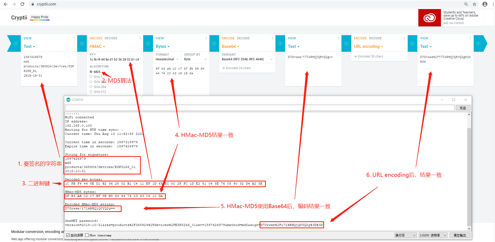

# ESP8266生成OneNET MQTTS密码(MD5)


### OneNET MQTTS密码生成方法

按照[OneNET token算法](https://open.iot.10086.cn/doc/mqtt/book/manual/auth/token.html)的说明，使用ESP8266生成MQTTS密码步骤如下：

1. 修改代码中的STASSID和STAPSK，令ESP8266能够连接到wifi上
2. 从互联网上获取当前时间
3. 从当前时间+24小时，作为OneNET token计算的过期时间
4. 构建签名用的字符串
5. 对设备key进行base64解码，得到的字节数组作为Hmac-MD5计算中的key
6. 对第四步生成的字符串做Hmac-MD5签名，得到字节数组
7. 对上一步得到的自己数组做base64编码
8. 对各参数值做URLEncode，构建OneNET token，这个token即是OneNET MQTTS认证时的密码

<br>

将上述步骤在Arduino中使用c++实现：

<br/>

```c++
#include <ESP8266WiFi.h>
#include <time.h>
#include <sstream>

#include <libb64/cencode.h>
#include <libb64/cdecode.h>

#ifndef STASSID
#define STASSID "ssid"
#define STAPSK  "password"
#endif

const char *ssid = STASSID;
const char *pass = STAPSK;

#define base64_alphabet "ABCDEFGHIJKLMNOPQRSTUVWXYZabcdefghijklmnopqrstuvwxyz0123456789+/"
#define base64_padding '='

#define SIZE 100
#define ONENET_CLIENT_ID "ESP8266_01"     // 设备名称
#define ONENET_USERNAME "321016"          // 平台分配的产品ID
#define ONENET_MQTT_VERSION "2018-10-31"
#define ONENET_MQTT_METHOD "md5"
#define DEFAULT_EXPIRE_IN_SECONDS 86400   // 24小时
#define ONENET_DEVICE_KEY "5XHGxLb9Rr25t5po+Y3c/mtqiS6ArjsLtzk/sS/D5x8="

void setup() {
  Serial.begin(115200);
  Serial.println();
  Serial.println();

  // We start by connecting to a WiFi network
  Serial.print("Connecting to ");
  Serial.println(ssid);
  WiFi.mode(WIFI_STA);
  WiFi.begin(ssid, pass);

  while (WiFi.status() != WL_CONNECTED) {
    delay(500);
    Serial.print(".");
  }
  Serial.println("");

  Serial.println("WiFi connected");
  Serial.println("IP address: ");
  Serial.println(WiFi.localIP());

  setClock();

  delay(1000);
  Serial.println("");
  time_t now = time(nullptr);
  Serial.print("Current time in seconds: ");
  Serial.println(now);

  time_t expire_time = now + DEFAULT_EXPIRE_IN_SECONDS;
  Serial.print("Expire time in seconds:  ");
  Serial.println(expire_time);
  Serial.println();

  // 要计算哈希值的字符串
  std::stringstream ss;
  ss << "products/" << ONENET_USERNAME << "/devices/" << ONENET_CLIENT_ID;
  char* temp = &*ss.str().begin();
  char resource[strlen(temp)];
  memcpy(resource, temp, strlen(temp) + 1);
  *temp = 0;
  ss.clear();
  ss.str("");
  ss << expire_time << '\n'
     << ONENET_MQTT_METHOD << '\n'
     << resource << '\n'
     << ONENET_MQTT_VERSION;
  Serial.println("String for signature: ");
  char* stringForSign = &*ss.str().begin();
  Serial.println(stringForSign);
  Serial.println();

  byte bytesForSign[strlen(stringForSign)];
  for(int i = 0; i < strlen(stringForSign); i++) {
    bytesForSign[i] = stringForSign[i];
  }

  // 得到key_bytes
  char* key_string = decode(ONENET_DEVICE_KEY);
  byte key_bytes[strlen(key_string)];
  Serial.println("Decoded key bytes: ");
  for(int i = 0; i < strlen(key_string); i++) {
    key_bytes[i] = key_string[i];
    if(key_bytes[i] < 0x10) Serial.print('0');
    Serial.print(key_bytes[i], HEX);
    Serial.print(' ');
  }
  Serial.println();
  Serial.println();

  // 得到hmac_md5
  byte hmac_result_bytes[16];
  hmac_md5(key_bytes, sizeof(key_bytes), bytesForSign, sizeof(bytesForSign), hmac_result_bytes);
  Serial.println("HMac-MD5 bytes:");
  for(int i = 0; i < 16; i++) {
    byte b = hmac_result_bytes[i];
    if(b < 0x10) Serial.print('0');
    Serial.print(b, HEX);
    Serial.print(' ');
  }
  Serial.println();
  Serial.println();

  char encoded_hmac_result[SIZE];
  base64_string_from_bytes(hmac_result_bytes, sizeof(hmac_result_bytes), encoded_hmac_result);
  Serial.println("Encoded HMac-MD5 string: ");
  Serial.println(encoded_hmac_result);
  Serial.println();
  Serial.println();

  // 生成password
  ss.clear();
  ss.str("");
  char resource_url_encoded[SIZE];
  url_encode(resource, strlen(resource), resource_url_encoded);
  char hmac_url_encoded[SIZE];
  url_encode(encoded_hmac_result, strlen(encoded_hmac_result), hmac_url_encoded);
  ss << "version=" << ONENET_MQTT_VERSION
     << "&res=" << resource_url_encoded
     << "&et=" << expire_time
     << "&method=" << ONENET_MQTT_METHOD
     << "&sign=" << hmac_url_encoded;
  Serial.println("OneNET password: ");
  Serial.println(&*ss.str().begin());
  ss.clear();
  ss.str("");
}

void loop() {
  // put your main code here, to run repeatedly:

}

char* encode(const char* input) {
  /* set up a destination buffer large enough to hold the encoded data */
  char* output = (char*)malloc(SIZE);
  /* keep track of our encoded position */
  char* c = output;
  /* store the number of bytes encoded by a single call */
  int cnt = 0;
  /* we need an encoder state */
  base64_encodestate s;
  
  /*---------- START ENCODING ----------*/
  /* initialise the encoder state */
  base64_init_encodestate(&s);
  /* gather data from the input and send it to the output */
  cnt = base64_encode_block(input, strlen(input), c, &s);
  c += cnt;
  /* since we have encoded the entire input string, we know that 
     there is no more input data; finalise the encoding */
  cnt = base64_encode_blockend(c, &s);
  c += cnt;
  /*---------- STOP ENCODING  ----------*/
  
  /* we want to print the encoded data, so null-terminate it: */
  *c = 0;
  
  return output;
}

char* decode(const char* input) {
  /* set up a destination buffer large enough to hold the encoded data */
  char* output = (char*)malloc(SIZE);
  /* keep track of our decoded position */
  char* c = output;
  /* store the number of bytes decoded by a single call */
  int cnt = 0;
  /* we need a decoder state */
  base64_decodestate s;
  
  /*---------- START DECODING ----------*/
  /* initialise the decoder state */
  base64_init_decodestate(&s);
  /* decode the input data */
  cnt = base64_decode_block(input, strlen(input), c, &s);
  c += cnt;
  /* note: there is no base64_decode_blockend! */
  /*---------- STOP DECODING  ----------*/
  
  /* we want to print the decoded data, so null-terminate it: */
  *c = 0;
  
  return output;
}

void hmac_md5(byte key[], int keyLength, byte msg[], int msgLength, byte result[]) {

  int blockSize = 64;
  byte baKey[64] = { 0x00, 0x00, 0x00, 0x00, 0x00, 0x00, 0x00, 0x00, 0x00, 0x00, 0x00, 0x00, 0x00, 0x00, 0x00, 0x00, 
                     0x00, 0x00, 0x00, 0x00, 0x00, 0x00, 0x00, 0x00, 0x00, 0x00, 0x00, 0x00, 0x00, 0x00, 0x00, 0x00, 
                     0x00, 0x00, 0x00, 0x00, 0x00, 0x00, 0x00, 0x00, 0x00, 0x00, 0x00, 0x00, 0x00, 0x00, 0x00, 0x00,
                     0x00, 0x00, 0x00, 0x00, 0x00, 0x00, 0x00, 0x00, 0x00, 0x00, 0x00, 0x00, 0x00, 0x00, 0x00, 0x00 };
  byte hash_result[16];
  byte baOuterKeyPadded[blockSize];
  byte baInnerKeyPadded[blockSize];
  byte tempHash[16];
  MD5Builder md5;

  if(keyLength > blockSize) {
    md5.begin();
    md5.add(key, keyLength);
    md5.calculate();
    md5.getBytes(baKey);
  }
  else {
    for(int i = 0; i < keyLength; i++) {
      baKey[i] = key[i];
    }
  }

  for (int i = 0; i < blockSize; i++) {
    baOuterKeyPadded[i] = baKey[i] ^ 0x5C;
    baInnerKeyPadded[i] = baKey[i] ^ 0x36;
  }

  // return hash(o_key_pad ∥ hash(i_key_pad ∥ message)) // Where ∥ is concatenation
  md5.begin();
  md5.add(baInnerKeyPadded, blockSize);
  md5.add(msg, msgLength);
  md5.calculate();
  md5.getBytes(tempHash);

  md5.begin();
  md5.add(baOuterKeyPadded, blockSize);
  md5.add(tempHash, 16);
  md5.calculate();
  md5.getBytes(hash_result);

  memcpy(result, hash_result, 16);
}

// Set time via NTP, as required for x.509 validation
void setClock() {
  configTime(3 * 3600, 0, "pool.ntp.org", "time.nist.gov");

  Serial.print("Waiting for NTP time sync: ");
  time_t now = time(nullptr);
  while (now < 8 * 3600 * 2) {
    delay(500);
    Serial.print(".");
    now = time(nullptr);
  }
  Serial.println("");
  struct tm timeinfo;
  gmtime_r(&now, &timeinfo);
  Serial.print("Current time: ");
  Serial.print(asctime(&timeinfo));
}

void base64_string_from_bytes(byte bytes[], int bytes_size, char result_char[]) {
  byte byte1, byte2, byte3;
  char octet1, octet2, octet3, octet4;
  std::stringstream ss;

  for (int i = 0; i < bytes_size; i += 3) {
    // Collect pair bytes
    byte1 = bytes[i];
    byte2 = i + 1 < bytes_size ? bytes[i + 1] : NULL;
    byte3 = i + 2 < bytes_size ? bytes[i + 2] : NULL;

    // Bits 1-6 from byte 1
    octet1 = byte1 >> 2;

    // Bits 7-8 from byte 1 joined by bits 1-4 from byte 2
    octet2 = ((byte1 & 3) << 4) | (byte2 >> 4);

    // Bits 4-8 from byte 2 joined by bits 1-2 from byte 3
    octet3 = ((byte2 & 15) << 2) | (byte3 >> 6);

    // Bits 3-8 from byte 3
    octet4 = byte3 & 63;

    // Map octets to characters
    ss << base64_alphabet[octet1] 
       << base64_alphabet[octet2]
       << (byte2 != NULL ? base64_alphabet[octet3] : base64_padding)
       << (byte3 != NULL ? base64_alphabet[octet4] : base64_padding);
  }
  char* temp = &*ss.str().begin();
  memcpy(result_char, temp, strlen(temp) + 1);
  ss.str("");
  *temp = 0;
}

void url_encode(char str_to_encode[], int str_length, char result_char[]) {
  std::stringstream ss;
  for (int i = 0; i < str_length; i++){
    char c = str_to_encode[i];
    if (c == '+'){
      ss << "%2B";
    } else if (c == ' '){
      ss << "%20";
    } else if (c == '/') {
      ss << "%2F";
    } else if (c == '?') {
      ss << "%3F";
    } else if (c == '%') {
      ss << "%25";
    } else if (c == '#') {
      ss << "%23";
    } else if (c == '&') {
      ss << "%26";
    } else if (c == '=') {
      ss << "%3D";
    } else {
      ss << c;
    }
  }
  char* temp = &*ss.str().begin();
  memcpy(result_char, temp, strlen(temp) + 1);
  ss.str("");
  *temp = 0;
}
```

<br/>

执行上述代码，把串口监视器的输出结果，与cryptii.com的结果进行比较，编码结果一致，如下图所示：




<br/>

**结论：代码生成的结果与cryptii.com一致。**

<br/>

另外，这个token可以在MQTT.fx中，成功[登录OneNET](register-onenet-mqtts.md#测试onenet-mqtts产品)。

<br/>

### 参考资料

1. MQTTs接入OneNET实例教学视频：https://v.qq.com/x/page/n09166l17fc.html
2. OneNET MQTTS设备接入
：https://open.iot.10086.cn/doc/mqtt/book/get-start/connect.html
3. MQTT客户端1.7.1下载：http://www.jensd.de/apps/mqttfx/1.7.1/
4. OneNET token生成工具：https://open.iot.10086.cn/doc/mqtt/book/manual/auth/tool.html
5. OneNET MQTTS开发指南：https://open.iot.10086.cn/doc/mqtt/book/device-develop/manual.html
