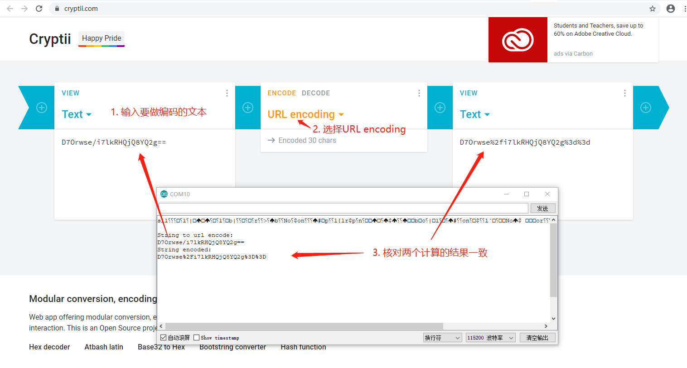

# ESP8266按OneNET URL Encode规则对字符串编码

在生成OneNET MQTTS密码的最后一步，需对每个参数中的值进行URL Encode编码。按照[token算法#参数编码](https://open.iot.10086.cn/doc/mqtt/book/manual/auth/token.html#%E5%8F%82%E6%95%B0%E7%BC%96%E7%A0%81)的编码表进行编码：

|序号  | 符号  | 编码|
|--- |--- |---|
|1 |  +  | %2B|
|2 |  空格 | %20|
|3 |  / | %2F|
|4 |  ? | %3F|
|5 |  % | %25|
|6 |  # | %23|
|7 |  & | %26|
|8 |  = | %3D|

<br>

将上述编码规则在Arduino中使用c++实现：

<br/>

```c++
#include <sstream>

#define STRING_TO_ENCODE "D7Orwse/i7lkRHQjQ8YQ2g=="
#define SIZE 100

void setup() {
  Serial.begin(115200);
  Serial.println();
  Serial.println();
  Serial.println("String to url encode: ");
  Serial.println(STRING_TO_ENCODE);
  char string_encoded[SIZE];
  url_encode(STRING_TO_ENCODE, strlen(STRING_TO_ENCODE), string_encoded);
  Serial.println("String encoded: ");
  Serial.println(string_encoded);
}

void loop() {
  // put your main code here, to run repeatedly:

}

void url_encode(char str_to_encode[], int str_length, char result_char[]) {
  std::stringstream ss;
  for (int i = 0; i < str_length; i++){
    char c = str_to_encode[i];
    if (c == '+'){
      ss << "%2B";
    } else if (c == ' '){
      ss << "%20";
    } else if (c == '/') {
      ss << "%2F";
    } else if (c == '?') {
      ss << "%3F";
    } else if (c == '%') {
      ss << "%25";
    } else if (c == '#') {
      ss << "%23";
    } else if (c == '&') {
      ss << "%26";
    } else if (c == '=') {
      ss << "%3D";
    } else {
      ss << c;
    }
  }
  char* temp = &*ss.str().begin();
  memcpy(result_char, temp, strlen(temp) + 1);
  ss.str("");
  *temp = 0;
}
```
<br/>

执行上述代码，把串口监视器的输出结果，与cryptii.com的结果进行比较，编码结果一致，如下图所示：



<br/>

**结论：代码生成的结果与cryptii.com一致。**

<br/>

### 参考资料

1. token算法#参数编码：https://open.iot.10086.cn/doc/mqtt/book/manual/auth/token.html#%E5%8F%82%E6%95%B0%E7%BC%96%E7%A0%81