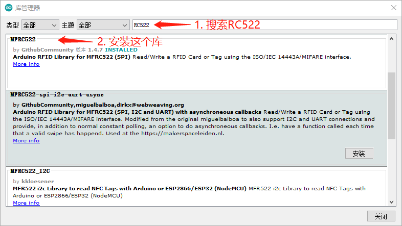
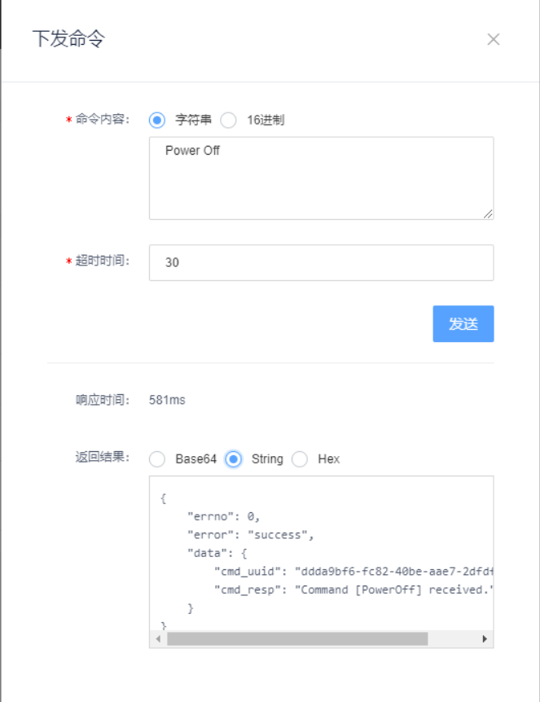

# ESP8266 RC522读卡

本节在[ESP8266接受OneNET MQTTS命令](esp8266-onenet-mqtts-command.md)的基础上，增加了ESP8266使用RC522读取任意RFID卡，通过OneNET MQTTS向本设备发送一条开门或关门命令，本机接收命令后SG90转动。

### Fritzing元件图
* ，导入其中的RFID-RC522-v3.fzpz文件

接线图如下图所示：


<br/>

### 基于MFRC522 by GithubCommunity的实现

在Arduino IDE的【库管理】中，安装MFRC522，如下图所示：


<br/>

### MFRC522样例代码

在Arduino中，修改和运行MFRC522库带的ReadNUID样例程序。调出ReadNUID示例代码的方法是，点击菜单【文件】->【示例】->【MFRC522】->【ReadNUID】，如下图所示：


ReadNUID样例程序，要修改为如下所示代码，才能符合前面的线路图接线，正确执行：

```c++
                                                                                                                                                                                                                                                                                                                                                                                                                                                                                                                                                                                                                                                                                                                                                                                                                                                                                                                                                                                                                                                                                                                                                                                                                                                                                                                                                                                                                                                                                                                                                                                                                                                                                                                                                                                                                                                                                                                                                                                                                                                                                  /*
 * --------------------------------------------------------------------------------------------------------------------
 * Example sketch/program showing how to read new NUID from a PICC to serial.
 * --------------------------------------------------------------------------------------------------------------------
 * This is a MFRC522 library example; for further details and other examples see: https://github.com/miguelbalboa/rfid
 * 
 * Example sketch/program showing how to the read data from a PICC (that is: a RFID Tag or Card) using a MFRC522 based RFID
 * Reader on the Arduino SPI interface.
 * 
 * When the Arduino and the MFRC522 module are connected (see the pin layout below), load this sketch into Arduino IDE
 * then verify/compile and upload it. To see the output: use Tools, Serial Monitor of the IDE (hit Ctrl+Shft+M). When
 * you present a PICC (that is: a RFID Tag or Card) at reading distance of the MFRC522 Reader/PCD, the serial output
 * will show the type, and the NUID if a new card has been detected. Note: you may see "Timeout in communication" messages
 * when removing the PICC from reading distance too early.
 * 
 * @license Released into the public domain.
 * 
 * Typical pin layout used:
 * -----------------------------------------------------------------------------------------
 *             MFRC522      Arduino       Arduino   Arduino    Arduino          Arduino
 *             Reader/PCD   Uno/101       Mega      Nano v3    Leonardo/Micro   Pro Micro
 * Signal      Pin          Pin           Pin       Pin        Pin              Pin
 * -----------------------------------------------------------------------------------------
 * RST/Reset   RST          9             5         D9         RESET/ICSP-5     RST
 * SPI SS      SDA(SS)      10            53        D10        10               10
 * SPI MOSI    MOSI         11 / ICSP-4   51        D11        ICSP-4           16
 * SPI MISO    MISO         12 / ICSP-1   50        D12        ICSP-1           14
 * SPI SCK     SCK          13 / ICSP-3   52        D13        ICSP-3           15
 */

#include <SPI.h>
#include <MFRC522.h>

// for ESP8266
#define D0 16
#define D1 5
#define D2 4
#define D3 0
#define D4 2
#define D5 14
#define D6 12
#define D7 13
#define D8 15
#define RX 3 // D9
#define TX 1 // D10

// for ESP8266, SDA(SS) -> D8, SCK -> D5, MOSI -> D7, MISO -> D6, RST -> D3
#define SS_PIN D8
#define RST_PIN D3
MFRC522 rfid(SS_PIN, RST_PIN); // Instance of the class
MFRC522::MIFARE_Key key; 

// Init array that will store new NUID 
byte nuidPICC[4];

void setup() { 
  Serial.begin(9600);
  SPI.begin(); // Init SPI bus
  rfid.PCD_Init(); // Init MFRC522 

  for (byte i = 0; i < 6; i++) {
    key.keyByte[i] = 0xFF;
  }

  Serial.println(F("This code scan the MIFARE Classsic NUID."));
  Serial.print(F("Using the following key:"));
  printHex(key.keyByte, MFRC522::MF_KEY_SIZE);
}
 
void loop() {

  // Reset the loop if no new card present on the sensor/reader. This saves the entire process when idle.
  if ( ! rfid.PICC_IsNewCardPresent())
    return;

  // Verify if the NUID has been readed
  if ( ! rfid.PICC_ReadCardSerial())
    return;

  Serial.print(F("PICC type: "));
  MFRC522::PICC_Type piccType = rfid.PICC_GetType(rfid.uid.sak);
  Serial.println(rfid.PICC_GetTypeName(piccType));

  // Check is the PICC of Classic MIFARE type
  if (piccType != MFRC522::PICC_TYPE_MIFARE_MINI &&  
    piccType != MFRC522::PICC_TYPE_MIFARE_1K &&
    piccType != MFRC522::PICC_TYPE_MIFARE_4K) {
    Serial.println(F("Your tag is not of type MIFARE Classic."));
    return;
  }

  if (rfid.uid.uidByte[0] != nuidPICC[0] || 
    rfid.uid.uidByte[1] != nuidPICC[1] || 
    rfid.uid.uidByte[2] != nuidPICC[2] || 
    rfid.uid.uidByte[3] != nuidPICC[3] ) {
    Serial.println(F("A new card has been detected."));

    // Store NUID into nuidPICC array
    for (byte i = 0; i < 4; i++) {
      nuidPICC[i] = rfid.uid.uidByte[i];
    }
   
    Serial.println(F("The NUID tag is:"));
    Serial.print(F("In hex: "));
    printHex(rfid.uid.uidByte, rfid.uid.size);
    Serial.println();
    Serial.print(F("In dec: "));
    printDec(rfid.uid.uidByte, rfid.uid.size);
    Serial.println();
  }
  else Serial.println(F("Card read previously."));

  // Halt PICC
  rfid.PICC_HaltA();

  // Stop encryption on PCD
  rfid.PCD_StopCrypto1();
}


/**
 * Helper routine to dump a byte array as hex values to Serial. 
 */
void printHex(byte *buffer, byte bufferSize) {
  for (byte i = 0; i < bufferSize; i++) {
    Serial.print(buffer[i] < 0x10 ? " 0" : " ");
    Serial.print(buffer[i], HEX);
  }
}

/**
 * Helper routine to dump a byte array as dec values to Serial.
 */
void printDec(byte *buffer, byte bufferSize) {
  for (byte i = 0; i < bufferSize; i++) {
    Serial.print(buffer[i] < 0x10 ? " 0" : " ");
    Serial.print(buffer[i], DEC);
  }
}
```

第34-49行，是针对ESP8266做的修改，替代了原来ReadNUID的第34和35行。

打开串口监视器，设为9600波特率，执行上述代码，同时使用两张RFID卡片，如果能显示出两张卡NUID，即RF522和接线均正确可用。

<br/>

### 代码说明

下面的代码是在[ESP8266接受OneNET MQTTS命令](esp8266-onenet-mqtts-command.md)基础上，结合本文上面的RC522读卡代码修改而成：

```c++

```

<br/>

代码第18行，引入Arduino自带的Servo库：

```c++
#include <Servo.h>
```

第41行，定义了一个全局Servo对象：

```c++
Servo servo;
```

<br/>

代码第102-138行，在接收到命令后，把响应发布到OneNET上：

```c++
void callback(char* topic, byte* payload, unsigned int length) {
  Serial.print("Message arrived [");
  Serial.print(topic);
  Serial.print("]: ");
  char receivedChar[length + 1];
  for (int i=0; i < length; i++) {
    receivedChar[i] = (char)payload[i];
    Serial.print(receivedChar[i]);
  }
  receivedChar[length] = '\0';
  std::string topicString = topic;
  std::string::size_type idx = topicString.find("/cmd/request/");
  if (idx != std::string::npos) {
    // 13 is the length of /cmd/request/
    std::string cmdId = topicString.substr(idx + 13);
    Serial.print(" ... comId: ");
    Serial.println(cmdId.c_str());
    // publish a response that command received
    char cmdResTopic[1024];
    getOnenetCmdResTopic(cmdResTopic, cmdId);
    char cmdResPayload[1024];
    generateOnenetCmdResPayload(cmdResPayload, receivedChar);
    Serial.print("Publish [");
    Serial.print(cmdResTopic);
    Serial.print("]: ");
    Serial.println(cmdResPayload);
    mqttclient.publish(cmdResTopic, cmdResPayload);

    // 缺省93度
    if (strcmp(receivedChar, "开门") == 0) {
      servo.write(0);
    } else if (strcmp(receivedChar, "关门") == 0) {
      servo.write(93);
    }
  } else {
    Serial.println();
  }
}
```

<br/>

第578-589行，是生成OneNET命令的响应信息，当命令是度数时，把伺服电机的角度数据放到响应信息里：

```c++
void generateOnenetCmdResPayload(char cmdResPayload[], char receivedChar[]) {
  std::stringstream ss;
  ss << "Command [" << receivedChar << "]" 
     << " received.";
  if (strcmp(receivedChar, "度数") == 0) {
    ss << "Motor angle: " << servo.read() << ".";
  }
  char* temp = &*ss.str().begin();
  memcpy(cmdResPayload, temp, strlen(temp) + 1);
  ss.str("");
  *temp = 0;
}
```

<br/>


运行上述代码，访问OneNET MQTT套件的后台，下发命令和接收响应信息，如下图所示：



<br/>


### 参考资料

1. Arduino PubSubClient: [https://www.arduinolibraries.info/libraries/pub-sub-client](https://www.arduinolibraries.info/libraries/pub-sub-client)

2. Auduino PubSubClient源代码：[https://github.com/knolleary/pubsubclient/](https://github.com/knolleary/pubsubclient/)

3. OneNET MQTT物联网套件开发指南：[https://open.iot.10086.cn/doc/mqtt/book/device-develop/manual.html](https://open.iot.10086.cn/doc/mqtt/book/device-develop/manual.html)

4. OneNET MQTT物联网套件-设备命令 topic 簇：[https://open.iot.10086.cn/doc/mqtt/book/device-develop/topics/cmd-topics.html](https://open.iot.10086.cn/doc/mqtt/book/device-develop/topics/cmd-topics.html)

5. 利用Nodemcu控制SG90舵机：[https://www.basemu.com/servo-motor-sg90-with-nodemcu.html](https://www.basemu.com/servo-motor-sg90-with-nodemcu.html)