# ESP8266访问Https网页
本节介绍使用ESP8266上网，访问Https静态网页。对于SSL证书校验，有六种方法，分别是：

* [不校验SSL证书](#不校验SSL证书)
* [允许已知证书指纹验证通过](#允许已知证书指纹验证通过)
* [允许自签证书验证通过](#允许自签证书验证通过)
* [仅允许已知证书键通过](#仅允许已知证书键通过)
* [仅允许已知发证机构证书验证通过](#仅允许已知发证机构证书验证通过)
* [使用证书库验证](esp8266-bearssl-certstore.md)

在Arduino IDE中，点击【文件】->【示例】->【ESP8266WiFi】->【BearSSL_Validation】，如下图所示：

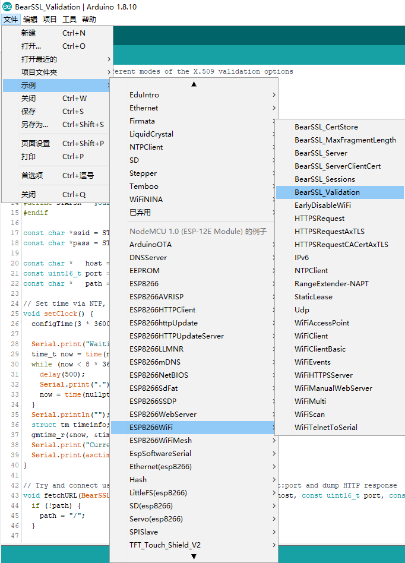

出现的代码如下：

```c++
// Example of the different modes of the X.509 validation options
// in the WiFiClientBearSSL object
//
// Mar 2018 by Earle F. Philhower, III
// Released to the public domain

#include <ESP8266WiFi.h>
#include <WiFiClientSecure.h>
#include <StackThunk.h>
#include <time.h>

#ifndef STASSID
#define STASSID "your-ssid"
#define STAPSK  "your-password"
#endif

const char *ssid = STASSID;
const char *pass = STAPSK;

const char *   host = "api.github.com";
const uint16_t port = 443;
const char *   path = "/";

// Set time via NTP, as required for x.509 validation
void setClock() {
  configTime(3 * 3600, 0, "pool.ntp.org", "time.nist.gov");

  Serial.print("Waiting for NTP time sync: ");
  time_t now = time(nullptr);
  while (now < 8 * 3600 * 2) {
    delay(500);
    Serial.print(".");
    now = time(nullptr);
  }
  Serial.println("");
  struct tm timeinfo;
  gmtime_r(&now, &timeinfo);
  Serial.print("Current time: ");
  Serial.print(asctime(&timeinfo));
}

// Try and connect using a WiFiClientBearSSL to specified host:port and dump HTTP response
void fetchURL(BearSSL::WiFiClientSecure *client, const char *host, const uint16_t port, const char *path) {
  if (!path) {
    path = "/";
  }

  ESP.resetFreeContStack();
  uint32_t freeStackStart = ESP.getFreeContStack();
  Serial.printf("Trying: %s:443...", host);
  client->connect(host, port);
  if (!client->connected()) {
    Serial.printf("*** Can't connect. ***\n-------\n");
    return;
  }
  Serial.printf("Connected!\n-------\n");
  client->write("GET ");
  client->write(path);
  client->write(" HTTP/1.0\r\nHost: ");
  client->write(host);
  client->write("\r\nUser-Agent: ESP8266\r\n");
  client->write("\r\n");
  uint32_t to = millis() + 5000;
  if (client->connected()) {
    do {
      char tmp[32];
      memset(tmp, 0, 32);
      int rlen = client->read((uint8_t*)tmp, sizeof(tmp) - 1);
      yield();
      if (rlen < 0) {
        break;
      }
      // Only print out first line up to \r, then abort connection
      char *nl = strchr(tmp, '\r');
      if (nl) {
        *nl = 0;
        Serial.print(tmp);
        break;
      }
      Serial.print(tmp);
    } while (millis() < to);
  }
  client->stop();
  uint32_t freeStackEnd = ESP.getFreeContStack();
  Serial.printf("\nCONT stack used: %d\n", freeStackStart - freeStackEnd);
  Serial.printf("BSSL stack used: %d\n-------\n\n", stack_thunk_get_max_usage());
}

void fetchNoConfig() {
  Serial.printf(R"EOF(
If there are no CAs or insecure options specified, BearSSL will not connect.
Expect the following call to fail as none have been configured.
)EOF");
  BearSSL::WiFiClientSecure client;
  fetchURL(&client, host, port, path);
}

void fetchInsecure() {
  Serial.printf(R"EOF(
This is absolutely *insecure*, but you can tell BearSSL not to check the
certificate of the server.  In this mode it will accept ANY certificate,
which is subject to man-in-the-middle (MITM) attacks.
)EOF");
  BearSSL::WiFiClientSecure client;
  client.setInsecure();
  fetchURL(&client, host, port, path);
}

void fetchFingerprint() {
  Serial.printf(R"EOF(
The SHA-1 fingerprint of an X.509 certificate can be used to validate it
instead of the while certificate.  This is not nearly as secure as real
X.509 validation, but is better than nothing.
)EOF");
  BearSSL::WiFiClientSecure client;
  static const char fp[] PROGMEM = "5F:F1:60:31:09:04:3E:F2:90:D2:B0:8A:50:38:04:E8:37:9F:BC:76";
  client.setFingerprint(fp);
  fetchURL(&client, host, port, path);
}

void fetchSelfSigned() {
  Serial.printf(R"EOF(
It is also possible to accept *any* self-signed certificate.  This is
absolutely insecure as anyone can make a self-signed certificate.
)EOF");
  BearSSL::WiFiClientSecure client;
  Serial.printf("First, try and connect to a badssl.com self-signed website (will fail):\n");
  fetchURL(&client, "self-signed.badssl.com", 443, "/");
  Serial.printf("Now we'll enable self-signed certs (will pass)\n");
  client.allowSelfSignedCerts();
  fetchURL(&client, "self-signed.badssl.com", 443, "/");
}

void fetchKnownKey() {
  Serial.printf(R"EOF(
The server certificate can be completely ignored and its public key
hardcoded in your application. This should be secure as the public key
needs to be paired with the private key of the site, which is obviously
private and not shared.  A MITM without the private key would not be
able to establish communications.
)EOF");
  // Extracted by: openssl x509 -pubkey -noout -in servercert.pem
  static const char pubkey[] PROGMEM = R"KEY(
-----BEGIN PUBLIC KEY-----
MIIBIjANBgkqhkiG9w0BAQEFAAOCAQ8AMIIBCgKCAQEAy+3Up8qBkIn/7S9AfWlH
Od8SdXmnWx+JCIHvnWzjFcLeLvQb2rMqqCDL5XDlvkyC5SZ8ZyLITemej5aJYuBv
zcKPzyZ0QfYZiskU9nzL2qBQj8alzJJ/Cc32AWuuWrPrzVxBmOEW9gRCGFCD3m0z
53y6GjcmBS2wcX7RagqbD7g2frEGko4G7kmW96H6dyh2j9Rou8TwAK6CnbiXPAM/
5Q6dyfdYlHOCgP75F7hhdKB5gpprm9A/OnQsmZjUPzy4u0EKCxE8MfhBerZrZdod
88ZdDG3CvTgm050bc+lGlbsT+s09lp0dgxSZIeI8+syV2Owt4YF/PdjeeymtzQdI
wQIDAQAB
-----END PUBLIC KEY-----
)KEY";
  BearSSL::WiFiClientSecure client;
  BearSSL::PublicKey key(pubkey);
  client.setKnownKey(&key);
  fetchURL(&client, host, port, path);
}

void fetchCertAuthority() {
  static const char digicert[] PROGMEM = R"EOF(
-----BEGIN CERTIFICATE-----
MIIDxTCCAq2gAwIBAgIQAqxcJmoLQJuPC3nyrkYldzANBgkqhkiG9w0BAQUFADBs
MQswCQYDVQQGEwJVUzEVMBMGA1UEChMMRGlnaUNlcnQgSW5jMRkwFwYDVQQLExB3
d3cuZGlnaWNlcnQuY29tMSswKQYDVQQDEyJEaWdpQ2VydCBIaWdoIEFzc3VyYW5j
ZSBFViBSb290IENBMB4XDTA2MTExMDAwMDAwMFoXDTMxMTExMDAwMDAwMFowbDEL
MAkGA1UEBhMCVVMxFTATBgNVBAoTDERpZ2lDZXJ0IEluYzEZMBcGA1UECxMQd3d3
LmRpZ2ljZXJ0LmNvbTErMCkGA1UEAxMiRGlnaUNlcnQgSGlnaCBBc3N1cmFuY2Ug
RVYgUm9vdCBDQTCCASIwDQYJKoZIhvcNAQEBBQADggEPADCCAQoCggEBAMbM5XPm
+9S75S0tMqbf5YE/yc0lSbZxKsPVlDRnogocsF9ppkCxxLeyj9CYpKlBWTrT3JTW
PNt0OKRKzE0lgvdKpVMSOO7zSW1xkX5jtqumX8OkhPhPYlG++MXs2ziS4wblCJEM
xChBVfvLWokVfnHoNb9Ncgk9vjo4UFt3MRuNs8ckRZqnrG0AFFoEt7oT61EKmEFB
Ik5lYYeBQVCmeVyJ3hlKV9Uu5l0cUyx+mM0aBhakaHPQNAQTXKFx01p8VdteZOE3
hzBWBOURtCmAEvF5OYiiAhF8J2a3iLd48soKqDirCmTCv2ZdlYTBoSUeh10aUAsg
EsxBu24LUTi4S8sCAwEAAaNjMGEwDgYDVR0PAQH/BAQDAgGGMA8GA1UdEwEB/wQF
MAMBAf8wHQYDVR0OBBYEFLE+w2kD+L9HAdSYJhoIAu9jZCvDMB8GA1UdIwQYMBaA
FLE+w2kD+L9HAdSYJhoIAu9jZCvDMA0GCSqGSIb3DQEBBQUAA4IBAQAcGgaX3Nec
nzyIZgYIVyHbIUf4KmeqvxgydkAQV8GK83rZEWWONfqe/EW1ntlMMUu4kehDLI6z
eM7b41N5cdblIZQB2lWHmiRk9opmzN6cN82oNLFpmyPInngiK3BD41VHMWEZ71jF
hS9OMPagMRYjyOfiZRYzy78aG6A9+MpeizGLYAiJLQwGXFK3xPkKmNEVX58Svnw2
Yzi9RKR/5CYrCsSXaQ3pjOLAEFe4yHYSkVXySGnYvCoCWw9E1CAx2/S6cCZdkGCe
vEsXCS+0yx5DaMkHJ8HSXPfqIbloEpw8nL+e/IBcm2PN7EeqJSdnoDfzAIJ9VNep
+OkuE6N36B9K
-----END CERTIFICATE-----
)EOF";

  Serial.printf(R"EOF(
A specific certification authority can be passed in and used to validate
a chain of certificates from a given server.  These will be validated
using BearSSL's rules, which do NOT include certificate revocation lists.
A specific server's certificate, or your own self-signed root certificate
can also be used.  ESP8266 time needs to be valid for checks to pass as
BearSSL does verify the notValidBefore/After fields.
)EOF");

  BearSSL::WiFiClientSecure client;
  BearSSL::X509List cert(digicert);
  client.setTrustAnchors(&cert);
  Serial.printf("Try validating without setting the time (should fail)\n");
  fetchURL(&client, host, port, path);

  Serial.printf("Try again after setting NTP time (should pass)\n");
  setClock();
  fetchURL(&client, host, port, path);
}

void fetchFaster() {
  Serial.printf(R"EOF(
The ciphers used to set up the SSL connection can be configured to
only support faster but less secure ciphers.  If you care about security
you won't want to do this.  If you need to maximize battery life, these
may make sense
)EOF");
  BearSSL::WiFiClientSecure client;
  client.setInsecure();
  uint32_t now = millis();
  fetchURL(&client, host, port, path);
  uint32_t delta = millis() - now;
  client.setInsecure();
  client.setCiphersLessSecure();
  now = millis();
  fetchURL(&client, host, port, path);
  uint32_t delta2 = millis() - now;
  std::vector<uint16_t> myCustomList = { BR_TLS_RSA_WITH_AES_256_CBC_SHA256, BR_TLS_ECDHE_ECDSA_WITH_AES_128_CBC_SHA, BR_TLS_RSA_WITH_3DES_EDE_CBC_SHA };
  client.setInsecure();
  client.setCiphers(myCustomList);
  now = millis();
  fetchURL(&client, host, port, path);
  uint32_t delta3 = millis() - now;
  Serial.printf("Using more secure: %dms\nUsing less secure ciphers: %dms\nUsing custom cipher list: %dms\n", delta, delta2, delta3);
}

void setup() {
  Serial.begin(115200);
  Serial.println();
  Serial.println();

  // We start by connecting to a WiFi network
  Serial.print("Connecting to ");
  Serial.println(ssid);
  WiFi.mode(WIFI_STA);
  WiFi.begin(ssid, pass);

  while (WiFi.status() != WL_CONNECTED) {
    delay(500);
    Serial.print(".");
  }
  Serial.println("");

  Serial.println("WiFi connected");
  Serial.println("IP address: ");
  Serial.println(WiFi.localIP());

  fetchNoConfig();
  fetchInsecure();
  fetchFingerprint();
  fetchSelfSigned();
  fetchKnownKey();
  fetchCertAuthority();
  fetchFaster();
}


void loop() {
  // Nothing to do here
}
```

<br/>

修改第13、14行的无线路由器ID和密码，即可成功执行代码。在运行代码之前，先选择调试端口和等级，这样可以看到一些详细的调试信息，设置方法如下图所示：

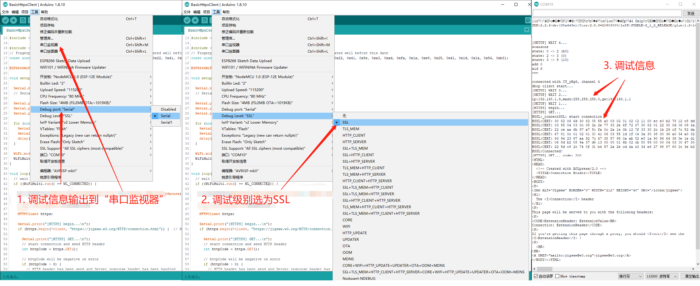

<br/>

### 不校验SSL证书

把254-260行中，除fetchInsecure()外，都注释掉，然后执行程序，如下图所示：

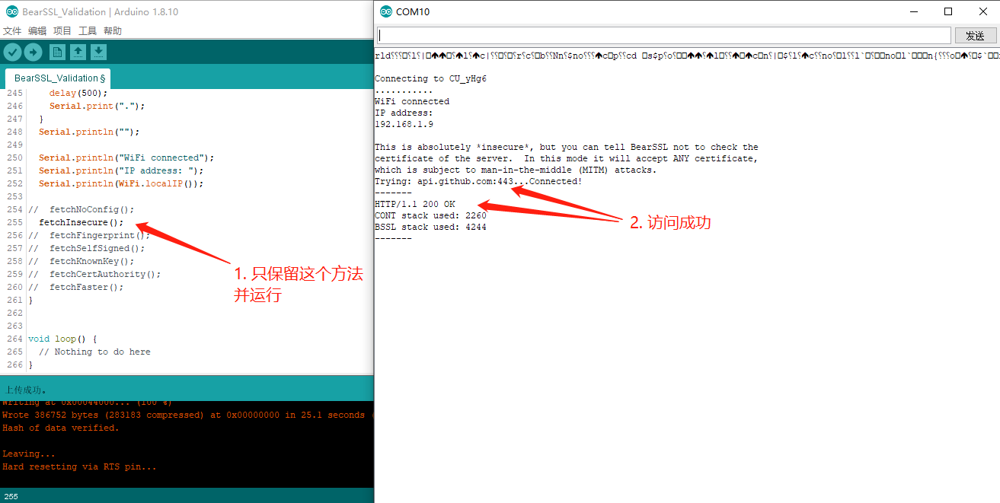

<br/>

### 允许已知证书指纹验证通过
把254-260行中，除fetchFingerprint()外，都注释掉，然后执行程序，如下图所示：

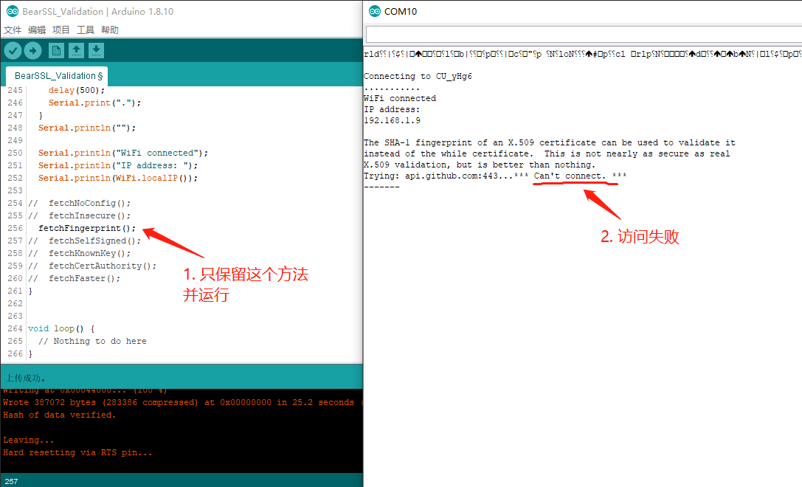

<br/>

##### 为什么访问失败？

访问失败，是因为第116行的指纹数据错误。指纹是指服务器SSL证书的SHA-1哈希值。通过以下两步，可以查看api.github.com的SSL证书指纹：

- 在浏览器中访问网站，点击网址前的锁图标，选择“证书”
- 在证书对话框中，选择“详细信息”标签，滚动到“指纹”行，点击“指纹”，出现指纹数据

如下图所示：

[api.github.com_ssl_fingerprint](images/ssl/api.github.com_ssl_fingerprint.png)

<br/>

##### 更新指纹

证书指纹数据，是十六进制的数据，全部大写后，每两个字符间，以冒号分隔即可变成了第116行的数据：

```
                                  5974618813ca1234154d110ac17fe667076942f5                           //浏览器中指纹数据
                                  5974618813CA1234154D110AC17FE667076942F5                           //全部大写
                                  59:74:61:88:13:CA:12:34:15:4D:11:0A:C1:7F:E6:67:07:69:42:F5        //每两个字符以冒号分隔
static const char fp[] PROGMEM = "59:74:61:88:13:CA:12:34:15:4D:11:0A:C1:7F:E6:67:07:69:42:F5";      //替换第116行
```

再次运行代码，访问成功，如下图所示：

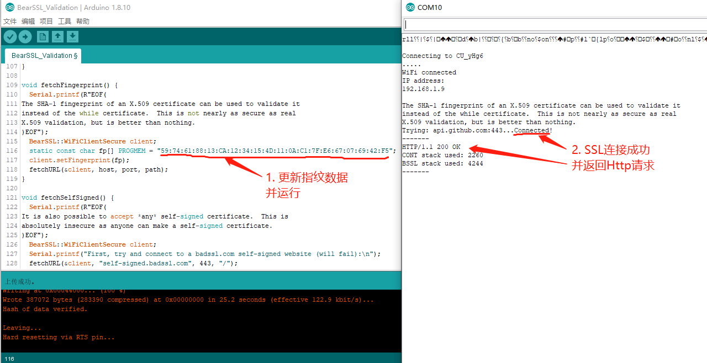

<br/>

##### 使用证书指纹验证，能访问自签证书/过期证书的网站吗？

为此，使用网站：https://self-signed.badssl.com/

* 使用这个网站的自签证书的指纹，替换第116行代码：

```
                                  99c1daf07c8d69a8a065492dcaae43c43ff13497                           // https://self-signed.badssl.com/的SSL证书指纹
                                  99C1DAF07C8D69A8A065492DCAAE43C43FF13497                           // 全部大写
                                  99:C1:DA:F0:7C:8D:69:A8:A0:65:49:2D:CA:AE:43:C4:3F:F1:34:97        // 每两个字符，以冒号分隔
static const char fp[] PROGMEM = "99:C1:DA:F0:7C:8D:69:A8:A0:65:49:2D:CA:AE:43:C4:3F:F1:34:97";      //替换第116行
```

* 第118行代码，使用self-signed.badssl.com替换api.github.com：
 把

```c++
  fetchURL(&client, host, port, path);
```

 替换为

```c++
  fetchURL(&client, "self-signed.badssl.com", 443, "/");
```

程序执行成功，如下图所示：

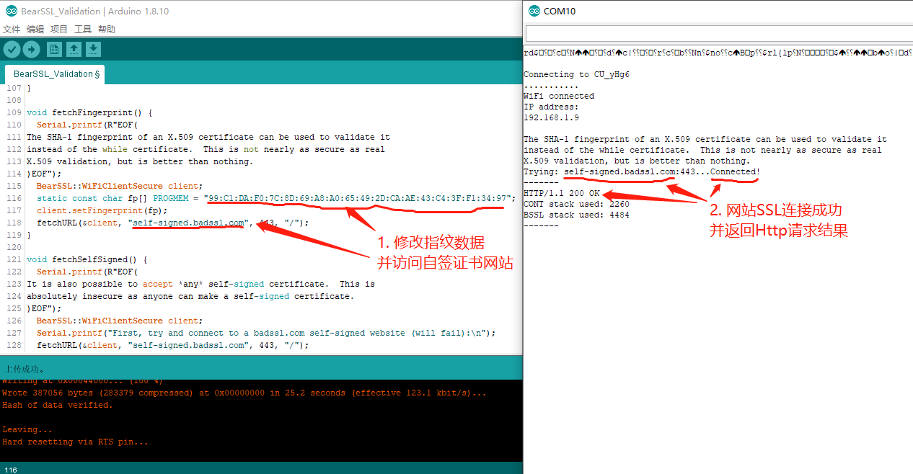

<br/>

### 允许自签证书验证通过

把254-260行中，除fetchSelfSigned()外，都注释掉，然后执行程序，访问成功，如下图所示：

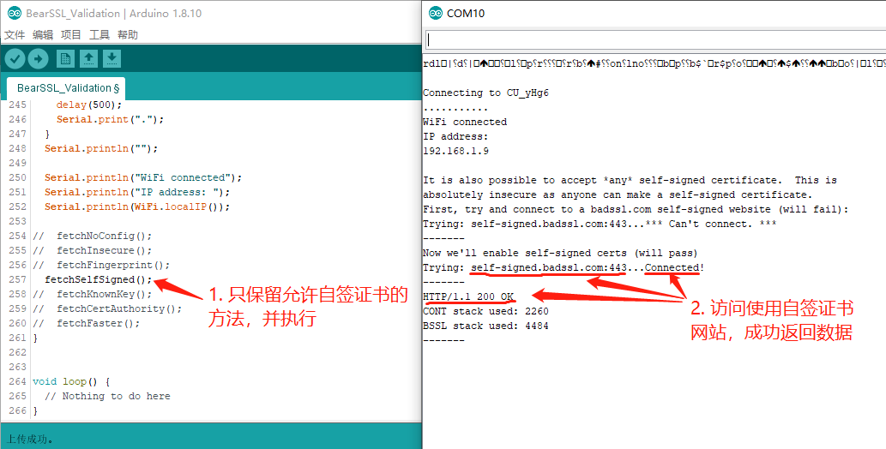

<br/>

**对于使用可信证书的网址，能正确访问吗？**

把第128行和第131行的self-signed.badssl.com替换为api.github.com，然后执行程序，访问失败，如下图所示：

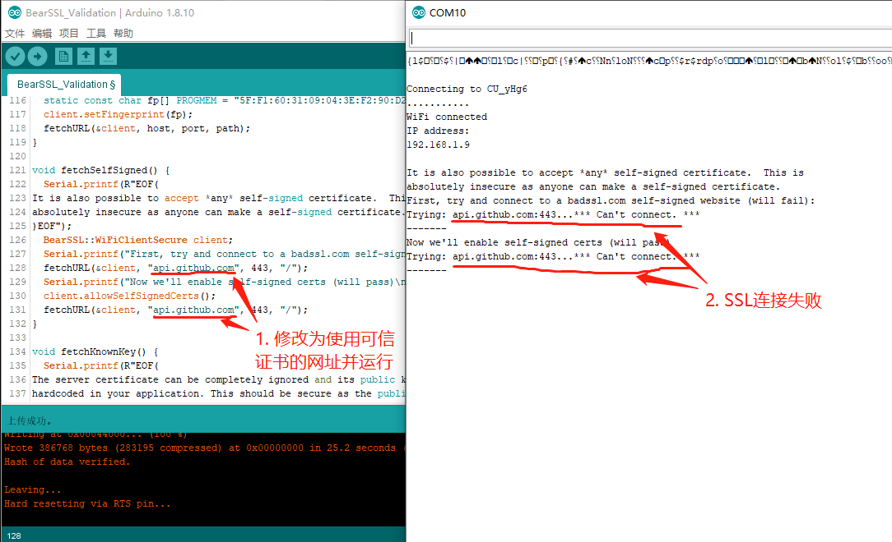

<br/>

### 仅允许已知证书键通过

把254-260行中，除fetchKnownKey()外，都注释掉，然后执行程序，访问失败，如下图所示：
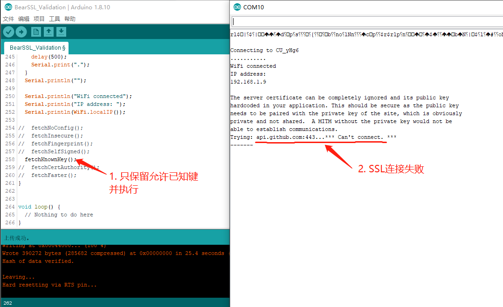

<br/>

##### 为什么访问失败？

失败原因，是代码中第145-151行的证书键，不是api.github.com的最新证书的证书键了，需要重新生成一个。

- 在浏览器中，访问https://api.github.com ，点击锁图标->【证书】
- 在“证书”对话框中，点击“详细信息”标签，以及“复制到文件”按钮
- 选择Base64格式，把服务器证书保存到github.cer文件中
- 在Dos窗口中，按照第142行的提示，运行：

```
openssl x509 -pubkey -noout -in github.cer
```

 输出结果是：

```
-----BEGIN PUBLIC KEY-----
MIIBIjANBgkqhkiG9w0BAQEFAAOCAQ8AMIIBCgKCAQEAsqTq71QH9GsamZqfLZ2y
JxkGcKITdcwKm+HC5J+fFAURhoksWESNFDlleAk2D2XDko7eewrGuaopycYmhSxC
zw87vJaEmQIRhi5tZpmErK+8Tz3/x6EHMqEUAZeeQwETs1fa31963kcxsqwYXFdX
dye5t7lQes0SnUHq5AeLIo0sif4yHm25+tbYioyybqbHTDUgctKTA7nwdHS9hOhB
/ZrNF7atucHBihS7LXLitRYRuP0mMbTxW0TrUmsAIAPLNdqGtMgsgVSk9RQvMqZg
mK/SSVvbgDI3EgzbXOLAmjKC07RJaeb2ylUcqY6VT6TnC++StZ5BvPHJ9JL5MNJQ
NQIDAQAB
-----END PUBLIC KEY-----
```

- 替换代码第145-151行的证书键，并执行
- 连接和访问成功，如下图所示：

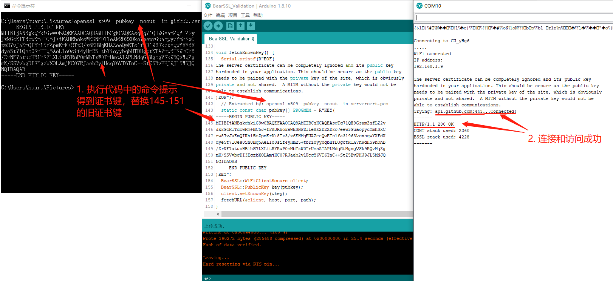

<br/>

##### 对于自签证书，证书键的方法会访问成功吗？

对于https://self-signed.badssl.com/，使用上面的方式重新生成证书键，还要把第157行的host，修改为self-signed.badssl.com，执行程序，访问成功。证书键如下：

```
-----BEGIN PUBLIC KEY-----
MIIBIjANBgkqhkiG9w0BAQEFAAOCAQ8AMIIBCgKCAQEAwgTs+IzuBMKz2FDVcFjM
kxjrXKhoSbAitfmVnrErLHY+bMBLYExM6rK0wA+AtrD5csmGAvlcQV0TK39xxEu8
6ZQuUDemZxxhjPZBQsVG0xaHJ5906wqdEVImIXNshEx5VeTRa+gGPUgVUq2zKNuq
/27/YJVKd2s58STRMbbdTcDE/FO5bUKttXz+rvUV0jNI5yJxx8IUemwo6jdK3+ps
tXK0flqiFtxpsVdE2woSq97DD0d0XEEi4Zr5G5PmrSIGKS6xukkcDCeeo/uL90By
AKySCNmMV4RTgQXL5v5rVJhAJ4XHELtzcO9pGEEHRVV8+WQ/PSzDqXzrkxpMhtHK
hQIDAQAB
-----END PUBLIC KEY-----
```

第157行修改后如下：

```c++
  fetchURL(&client, "self-signed.badssl.com", port, path);
```

执行结果如下图所示：

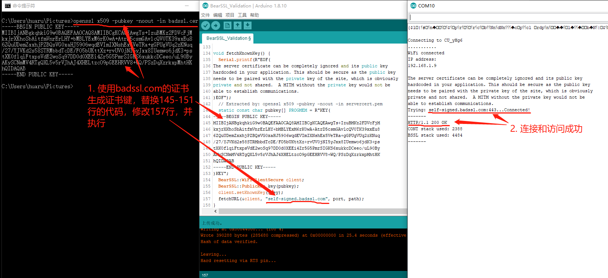

<br/>

### 仅允许已知发证机构证书验证通过

把254-260行中，除fetchCertAuthority()外，都注释掉，然后执行程序，如下图所示：

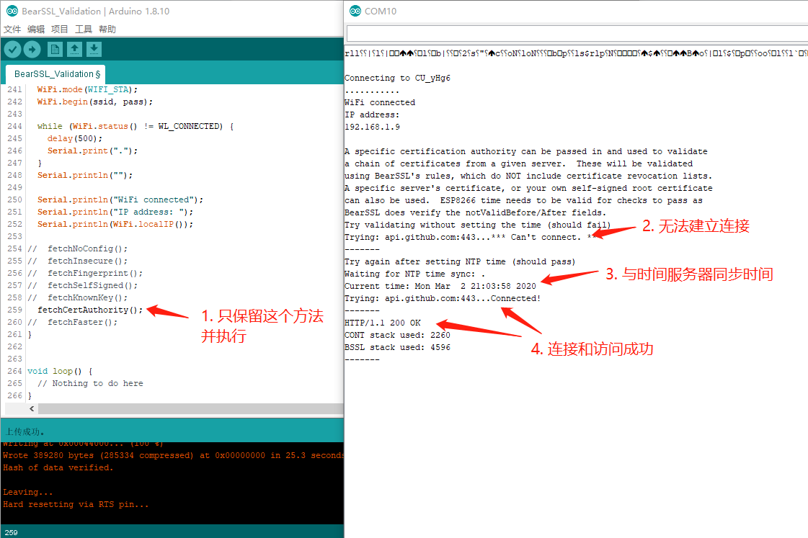

<br/>

##### 第162-184行的证书是什么？

这个证书，是签发github.com服务器证书的CA根证书，获取这个根证书的方法是：

- 在浏览器中，访问​https://api.github.com ，点击锁图标->【证书】
- 在“证书”对话框中，点击“证书路径”标签，选择根证书DigiCert，点击“查看证书”按钮
- 又出现一个关于DigiCert的“证书”对话框，点击“详细信息”，点击“复制到文件”按钮
- 在“证书导出向导”对话框中，选择“Base64编码”，把DigiCert根证书保存到DigiCert_root.cer文件中

如下图所示：
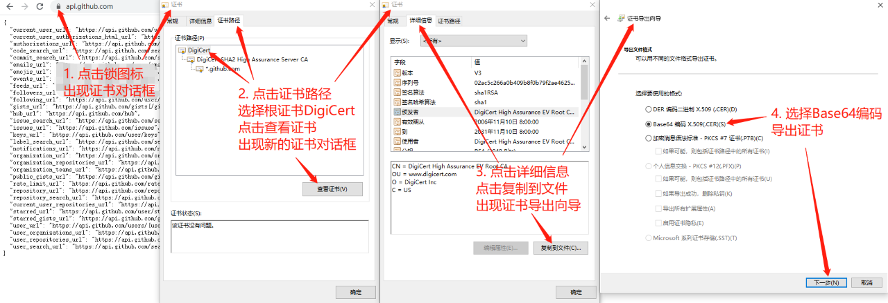

<br/>

下图比较了代码中的CA根证书与DigiCert_root.cer文件内容，两者完全一致：

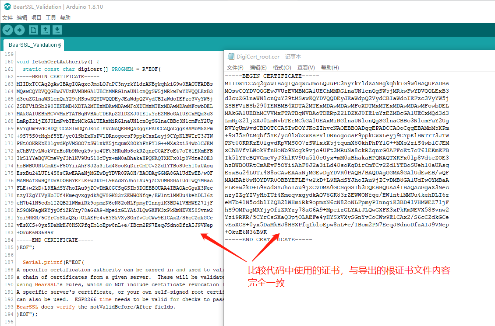 

<br/>

##### fetchCertAuthority能访问自签证书网站吗？

仍然使用https://self-signed.badssl.com/来进行验证，验证结果是能够访问，具体步骤如下：

- 把之前导出的badssl.cer文件内容，替换代码第162-184行
- 把第200行和204行的host，替换为self-signed.badssl.com：

```c++
  fetchURL(&client, host, port, path);
```

替换为：

```c++
  fetchURL(&client, "self-signed.badssl.com", port, path);
```

- 执行代码，连接和访问成功，如下图所示：

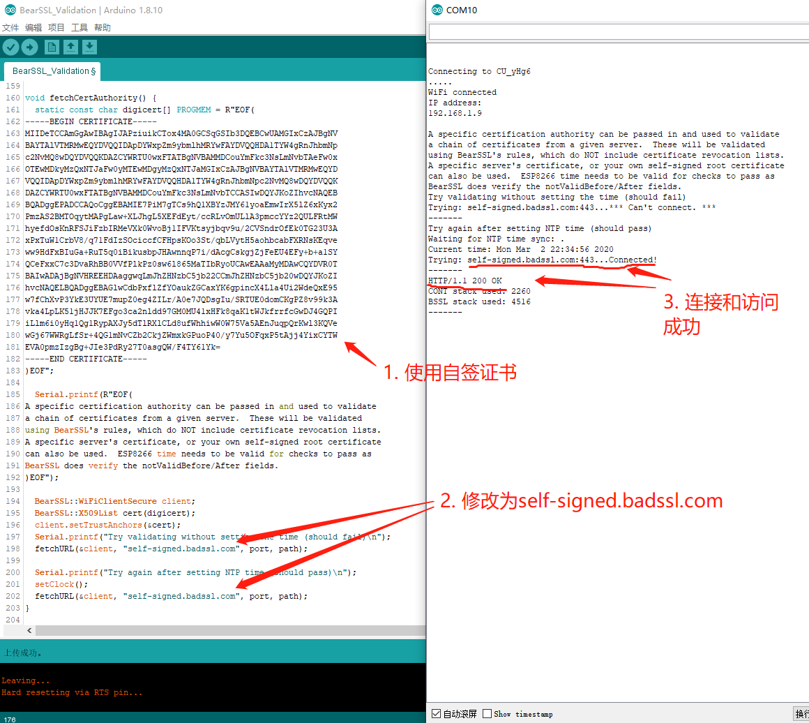 

<br/>

### 参考资料
* [https://github.com/esp8266/Arduino/blob/2.6.3/libraries/ESP8266WiFi/examples/BearSSL_Validation/BearSSL_Validation.ino](https://github.com/esp8266/Arduino/blob/2.6.3/libraries/ESP8266WiFi/examples/BearSSL_Validation/BearSSL_Validation.ino)
* [https://api.github.com/](https://api.github.com/)
* [https://self-signed.badssl.com/](https://self-signed.badssl.com/)
* [Windows安装使用Openssl](https://blog.csdn.net/kitok/article/details/72957185)