# 注册和测试OneNET MQTTS产品

### 注册OneNET MQTTS产品

OneNET MQTTS产品可以免费注册，步骤是：

1. 免费注册一个OneNET账号，网址：https://open.iot.10086.cn/passport/reg?appid=1&invite=1

2. 登录后，点击【开发者中心】->【MQTT物联网套件(新版)】

3. 点击【添加产品】，填写内容后完成添加

4. 点击新添加的产品名称链接，进入【产品概况】页面，记下产品ID，在下一步生成MQTTS登录密码时会用到。产品概况页面如下图所示：

 

5. 点击左侧菜单栏中的【设备列表】，进入【设备列表】页面，如下图所示：

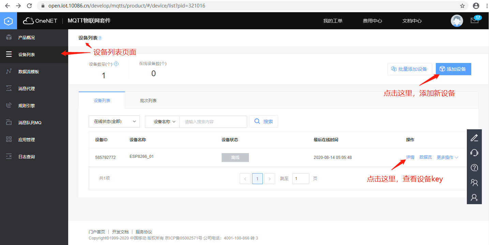

 

6. 点击【添加设备】，添加设备后，点击【详情】，进入设备详情页面，记下设备的key，在下一步生成MQTTS登录密码时会用到。设备详情如下图所示：

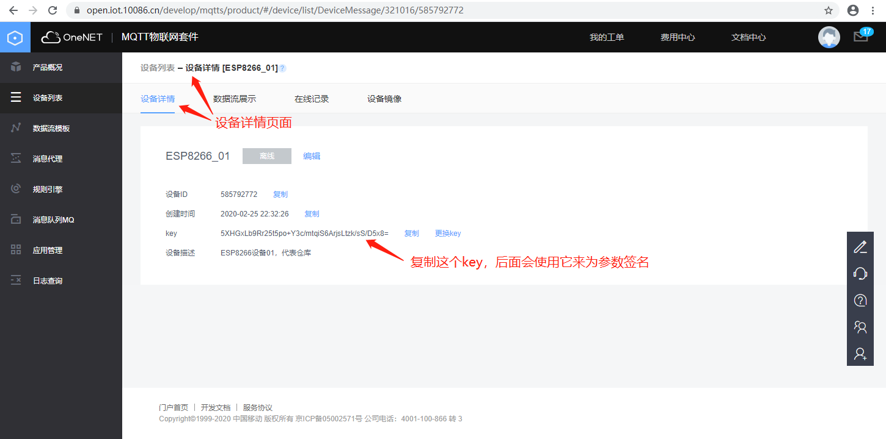

 

### 测试OneNET MQTTS产品

下面以OneNET MQTTS文档中的MQTT.fx客户端方式，测试下MQTTS不加密和加密的登录、发送数据、接收数据、接收命令。

* **MQTT.fx不加密登录**

    - 下载并安装[MQTT.fx 1.7.1](http://www.jensd.de/apps/mqttfx/1.7.1/)
    - 下载并安装[OneNET token生成工具](https://open.iot.10086.cn/doc/mqtt/images/tools/token.exe)
    - 在计算OneNET token时，有个过期时间参数，单位是秒，含义是从1970年1月1日零点算起的秒数。访问https://www.utctime.net/utc-timestamp ，可以获得当前时间的秒数，注意，这个时间是格林威治时间，如果变成东八区时间，需要加上8小时x3600秒/小时=28800，再加上过期时间比如24小时=86400秒，即可作为计算token时的过期时间参数。网页上的时间如下图所示：
    
     
    
    - 启动OneNET token生成工具，这个工具生成的结果，是下面访问OneNET MQTTS的密码，示例如下图所示：
    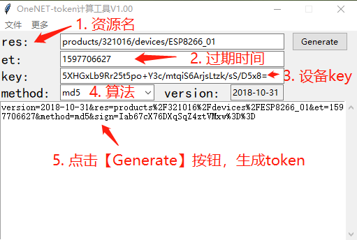
     
    
    - 启动MQTT.fx 1.7.1
    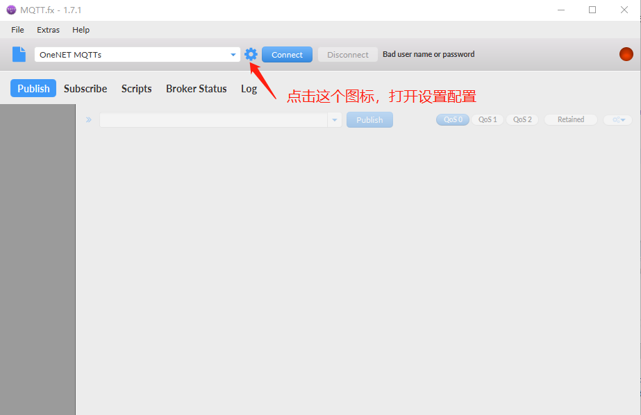
     
    
    - 点击左下角的+号，新建一个名为OneNET MQTT的配置，如下图所示：
    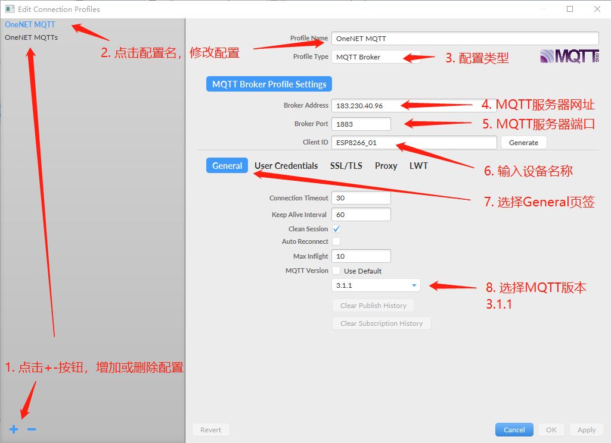
     

    - 点击【User Credentials】页签，在“User Name”填入OneNET的产品ID，在密码中填入上面计算出的token，然后点击【OK】按钮
    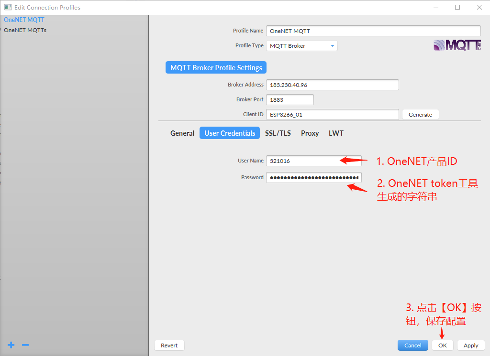
     

    - 点击【Connect】按钮，连接OneNET MQTT成功，如下图所示：
    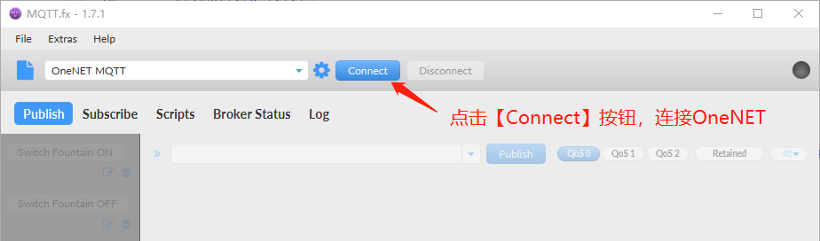
    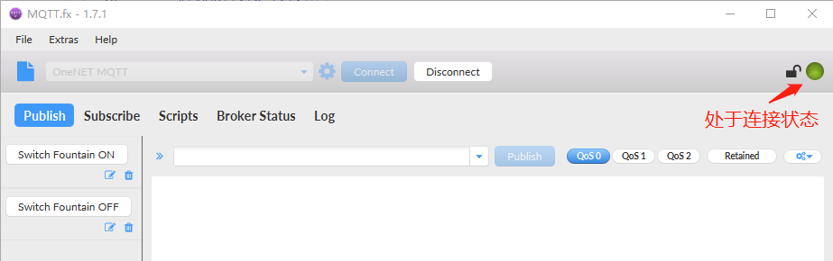
     

    - 在OneNET设备列表页面中，确认ESP8266_01**在线**，如下图所示：
    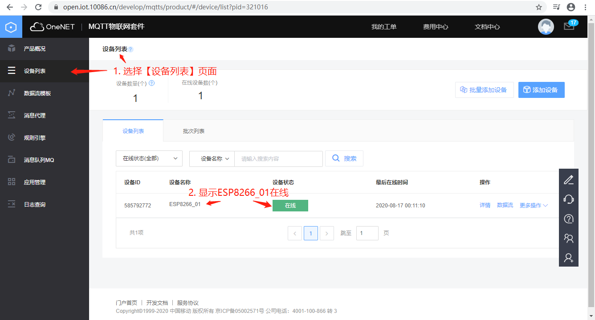
     

    - 在MQTT.fx中，点击【Disconnect】按钮，断开与OneNET MQTT的连接，如下图所示：
    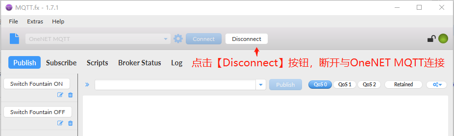
     

    - 在OneNET设备列表页面中，确认ESP8266_01**离线**，如下图所示：
    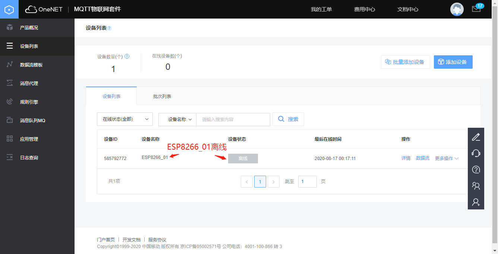
     

 

* **MQTT.fx加密登录**

  MQTT.fx加密登录，与上面的不加密登录，需要多加一个【SSL/TLS】页签的设置，服务器网址和端口不同，其它步骤都一样。步骤如下：

    - 从[OneNET MQTT开发指南](https://open.iot.10086.cn/doc/mqtt/book/device-develop/manual.html)页面下载证书压缩文件，如下图所示：
    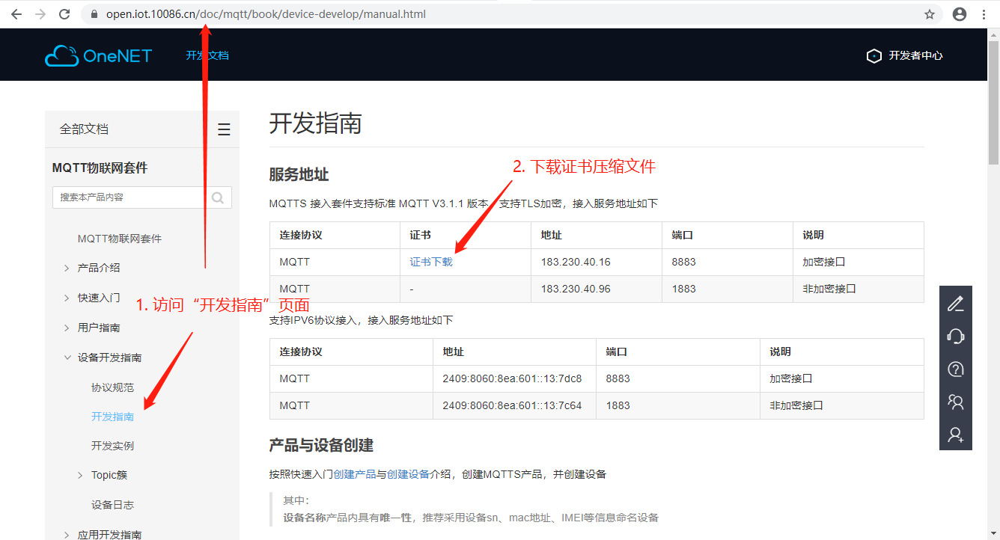
     
    
    - 把文件解压缩
    - 在MQTT.fx中，新建一个“OneNET MQTTs”的配置，选择【SSL/TLS】页签，如下图所示：
    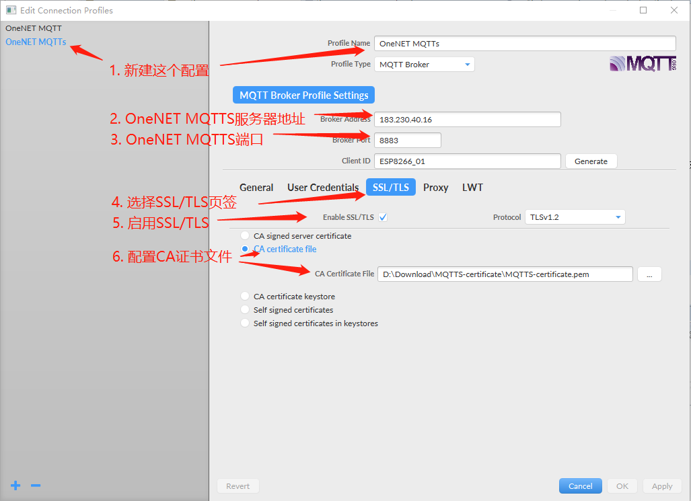
     
    
    - 点击【OK】按钮后，连接OneNET MQTTS，能够正常连接
    
 

* **接收数据**

 

* **发送数据**

 

* **接收命令**

 

### 参考资料

1. MQTTS接入OneNET实例教学视频：https://v.qq.com/x/page/n09166l17fc.html
2. OneNET MQTTS设备接入
：https://open.iot.10086.cn/doc/mqtt/book/get-start/connect.html
3. MQTT客户端1.7.1下载：http://www.jensd.de/apps/mqttfx/1.7.1/
4. OneNET token生成工具：https://open.iot.10086.cn/doc/mqtt/book/manual/auth/tool.html
5. OneNET MQTTS开发指南：https://open.iot.10086.cn/doc/mqtt/book/device-develop/manual.html
6. 以秒数表示的当前时间：https://www.utctime.net/utc-timestamp
7. OneNET数据点topic簇：https://open.iot.10086.cn/doc/mqtt/book/device-develop/topics/dp-topics.html
8. OneNET设备命令topic簇：https://open.iot.10086.cn/doc/mqtt/book/device-develop/topics/cmd-topics.html