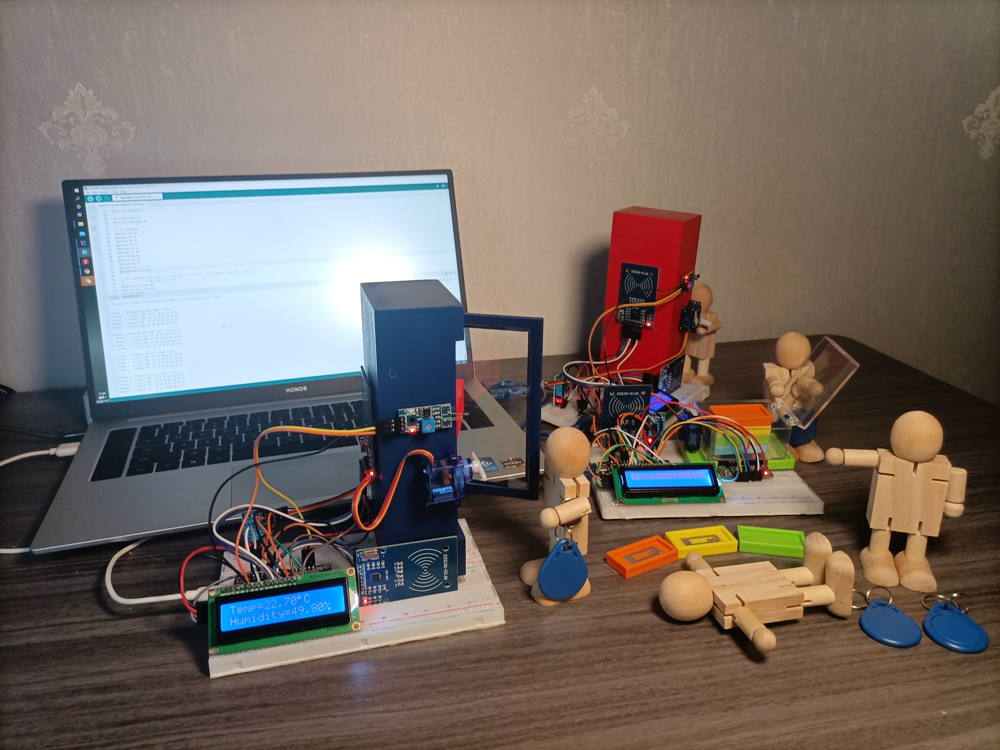
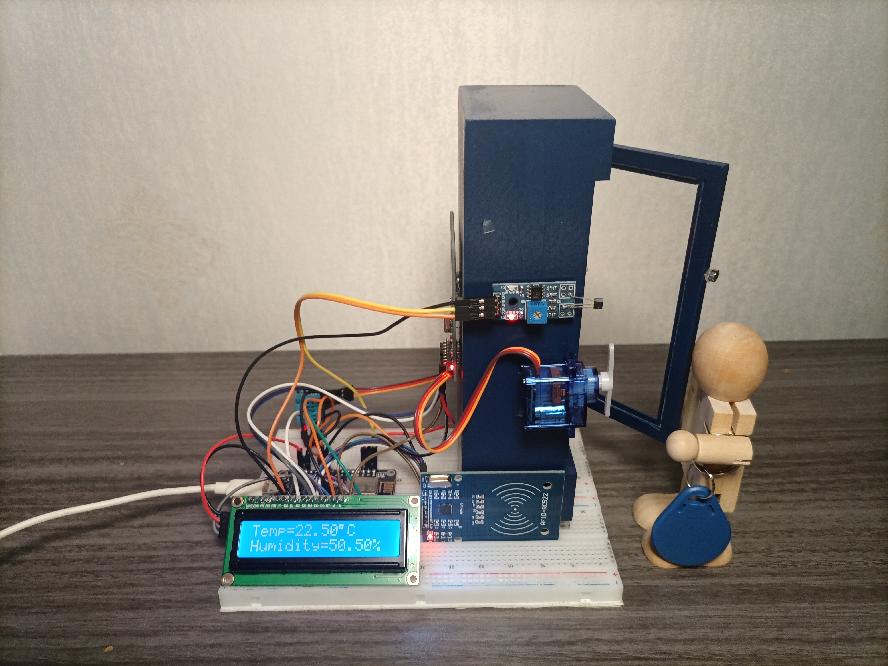
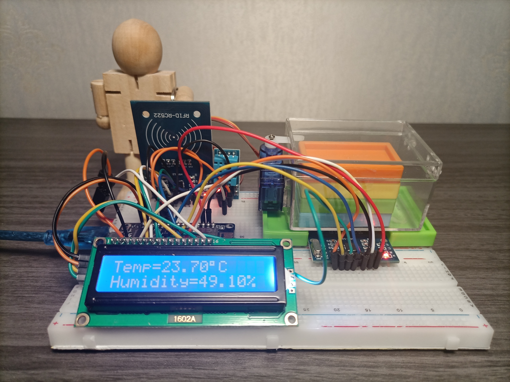

# 零售示例: 基于RFID的自动售货机

基于RFID的自动售货机(RFID-Operated Vendering Marchines，简称rovem)，由两个柜子和一个库房组成，如下图所示：

其中，柜子是：

库房是：

### 准备
**硬件：**

| 名称 | 数量 |
| :--- | ---: | 
| ESP8266开发板 | 3 |
| DHT11 | 3 |
| LCD1602(带I2C) | 3 |
| 面包板 | 6 |
| RFID-RC522 | 6 |
| SG90(Micro Servo 9g) | 3 |
| RFID标签 (如NTAG213 2x1cm) | 20 |
| 多米诺 (4.4x2.2x0.82cm) | 14 |
| 塑料盒 (6.4x4.7x3.7cm) | 1 |
| 小木箱 (7x4.8x17.5cm) | 2 |
| RFID卡 | 5 |
| LM393-A3144霍尔效应板 (2.93x1.38cm) | 2 |
| 磁铁 (Φ5x2mm) | 2 |
   
 

**软件：**
* Arduino
* JDK
* Apache OFBiz
* OFBiz模块：
  * sand-rfid
  * sand-onenet
  * sand-workbench

 

**MQTT服务：**
* OneNET MQTT

 

### 内容
* [场景介绍]()
* 库房功能
  * 新建商品
  * 入库
  * 出库
* 自动售货机功能
  * 补货
  * 售货
